# Architecture

OttoWM is a headless agent that offers several workspaces on one native macOS Space.

## Vocabulary

| Concept        | Meaning                                                                                                       |
|----------------|---------------------------------------------------------------------------------------------------------------|
| Native Space   | A macOS space. OttoWM uses only the one it starts on. A window on another Space is ignored.                   |
| Desktop        | The native Space OttoWM controls, and the component that moves windows on it.                                 |
| Workspace      | A numbered set of windows. It exists as soon as an action names it.                                           |
| Managed window | A window that belongs to a workspace.                                                                         |
| Placement      | Where a managed window sits: `active` on screen, or `parked` at the hidden edge.                              |
| Hidden edge    | The bottom-right corner of the display. A parked window sits there.                                           |
| Tab group      | The windows macOS shows as tabs of one window. See [Tabbed windows](#tabbed-windows).                         |
| Window id      | The `CGWindowID` of a window. It identifies the window for as long as the window lives.                       |
| Frame          | A rect in top-left coordinates.                                                                               |
| Operation      | One unit of engine work. The focused window and the list of on-screen window ids are read at most once in it. |

## Key types

```
WindowEvent  = created(WindowSnapshot) | focused(WindowSnapshot) | destroyed(id) | minimized(id) | unminimized(WindowSnapshot)
Action       = switchToWorkspace(n) | moveWindowToWorkspace(n) | focus(direction) | moveWindow(step) | quit | restart
Direction    = north | east | south | west                       // "focus east" in the config
Step         = (direction, points)                               // "move-window east 15" in the config
KeyCombo     = (keyCode, [ModifierKey: ModifierSide])            // "lopt-shift-1"
Placement    = active | parked
WindowSnapshot(id, appName, isStandard, hasCloseButton, hasMinimizeButton, isFullScreen, isMinimized, frame)
```

## Level 1 — Context

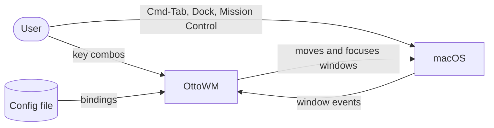

## Level 2 — Subsystems

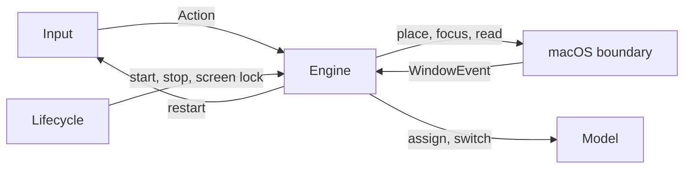

## Level 3 — Components

| Component                   | Category  | Description                                                                             |
|-----------------------------|-----------|-----------------------------------------------------------------------------------------|
| `ConfigFile`                | Input     | Reads the user's config file, or the bundled one.                                       |
| `Config`                    | Input     | The `KeyCombo → Action` table, indexed by key code.                                     |
| `Bindings`                  | Input     | The bindings currently up: `start`, `stop`, `reload`.                                   |
| `Hotkeys`                   | Input     | A session `CGEventTap` on keyDown, running on a thread of its own.                      |
| `Engine`                    | Engine    | Turns window events and actions into model updates and window moves.                    |
| `Workspaces`                | Model     | Window → workspace, focus history, current workspace.                                   |
| `Workspace`                 | Model     | The windows of one workspace and the order they were focused in.                        |
| `TabGroups`                 | Model     | Infers which windows are tabs of one another. Reads a window's tab count on demand.     |
| `Neighbors`                 | Model     | The windows around one frame, and which of them a focus move lands on.                  |
| `Step`                      | Model     | One move of a window in points, and where it lands within the screen.                   |
| `AwaitedFocus`              | Model     | The focus requests `Engine` made and has not seen answered.                             |
| `WorkspaceBeforeFullScreen` | Model     | The workspace each full screen window returns to.                                       |
| `ParkedWindows`             | Model     | The windows parked at the hidden edge, and the frame each one is owed back.             |
| `Desktop`                   | macOS     | Parks a window at the hidden edge, restores the frame it is owed, and steps it around.  |
| `HiddenEdge`                | macOS     | The corner sliver a parked window sits in, and the frame one is recovered to.           |
| `WindowSystem`              | macOS     | The focused window, the on-screen window frames, and the tab count of a window.         |
| `AXWindowObserver`          | macOS     | Which applications count, and the `NSWorkspace` notifications of their lifecycle.       |
| `AXWindowEvents`            | macOS     | The AX notifications of the watched applications, as `WindowEvent`s.                    |
| `Applications`              | macOS     | The applications watched, and the window each `CGWindowID` belongs to.                  |
| `Application`               | macOS     | One watched application: its windows and their ids, its channel, and its subscription.  |
| `Subscription`              | macOS     | The AX notifications one element is subscribed to, and whether the attempt succeeded.   |
| `AXNotifications`           | macOS     | The AX notification channel of one process: subscribe an element, invalidate the lot.   |
| `Window`                    | macOS     | The window operations the placement layer needs: snapshot, frames, moves, focus, tabs.  |
| `AXWindow`                  | macOS     | One window: snapshot, frame writes, focus, tab count.                                   |
| `MainScreen`                | macOS     | The geometry of the main display, in top-left coordinates.                              |
| `OperationCache`            | macOS     | Holds one AX or CG read for the length of an operation.                                 |
| `RoundTrips`                | macOS     | Prices an operation in the calls it makes out of the process: how many, of what, cost.  |
| `Signposts`                 | macOS     | The operation and round-trip intervals Instruments records.                             |
| `AppDelegate`               | Lifecycle | The startup order.                                                                      |
| `AccessibilityPermission`   | Lifecycle | The startup gate, and the watch on the accessibility trust.                             |
| `ScreenLock`                | Lifecycle | Reports whether the login window covers the session, and when it is uncovered.          |
| `Lifecycle`                 | Lifecycle | The transitions once it owns windows: `quit`, SIGTERM, relaunch, resync on unlock.      |
| `AccessibilityAlert`        | UI        | The accessibility permission alerts: what they say and how they show.                   |

`Window` is a protocol; `AXWindow` is the implementation the app runs.

`Desktop` is a protocol; `OffscreenParkingDesktop` is the implementation the app runs. It holds no state of its own: `Engine` hands it the frame each window is owed, and records what the placement reports back in `ParkedWindows`, which it reads to tell an active window from a parked one.

### Input

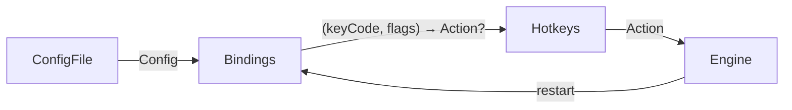

The tap thread matches the key and dispatches the action to the main queue, the only thread the accessibility writes are allowed on.

### Engine and model

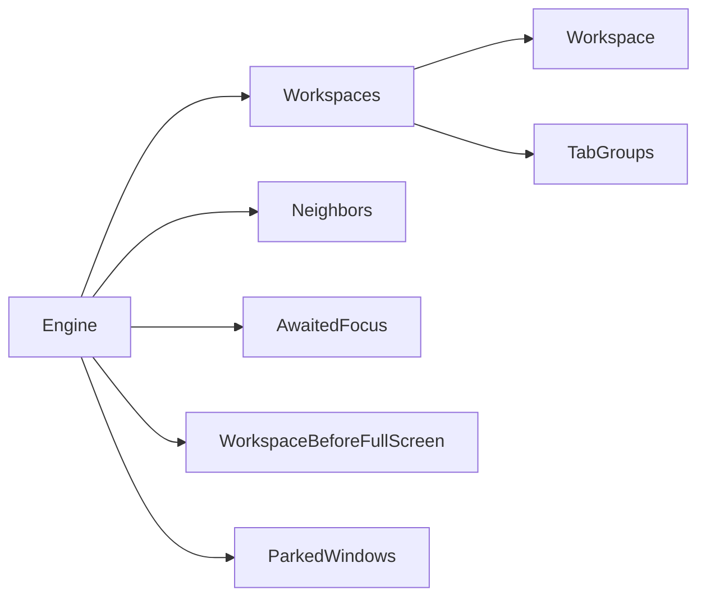

Every window event, and every action that touches windows, runs inside `WindowSystem.duringOperation`. Events are dropped while the screen is locked, where every window reads as closed.

### macOS boundary

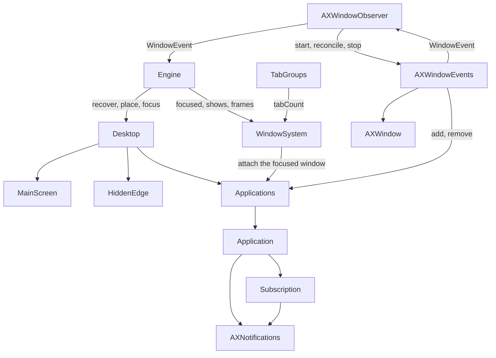

### Lifecycle

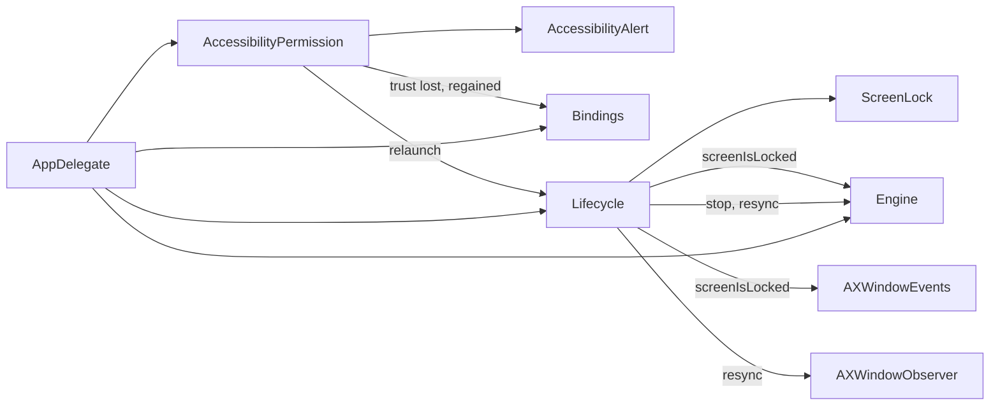

## Flows

### Startup

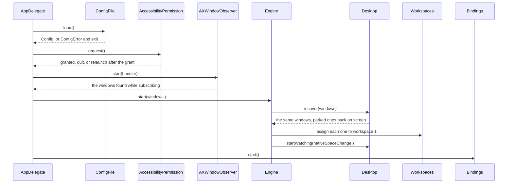

### Workspace switch

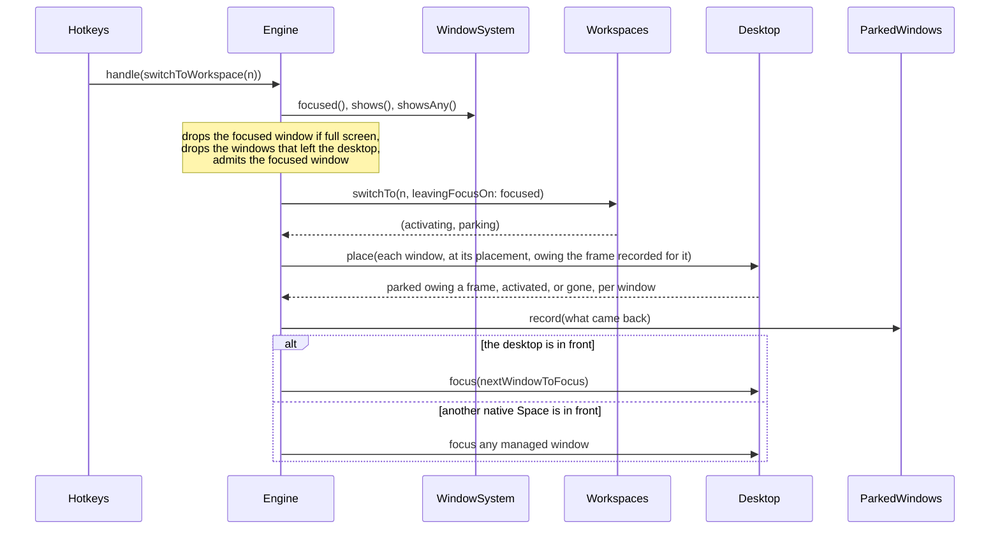

A window `Desktop.place` cannot reach is no longer managed (maybe moved to another native space).

### Move window to workspace

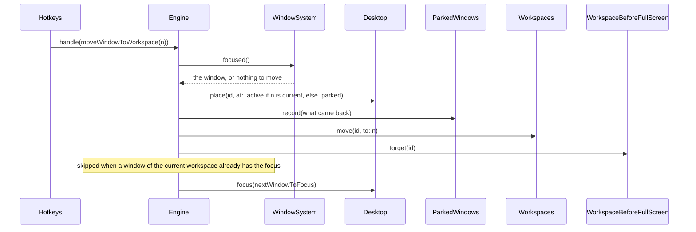

### Focus a neighbour window

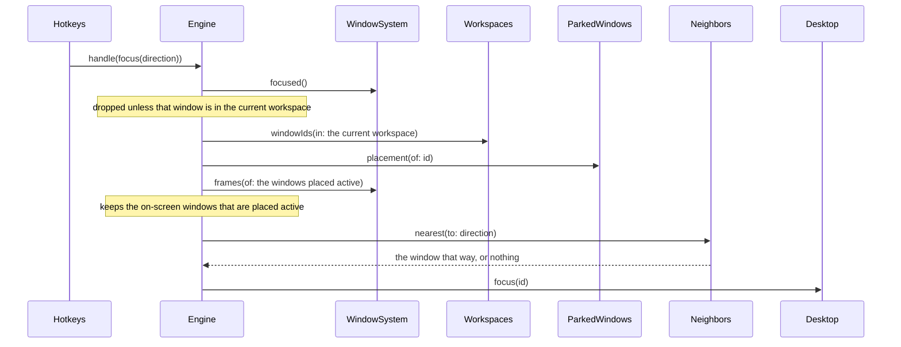

Selects the nearest window (from the active workspace) in the direction pressed, or does nothing if there is none.

### Manual navigation

The user can reach a parked window without OttoWM, through Cmd-Tab, the Dock or Mission Control.

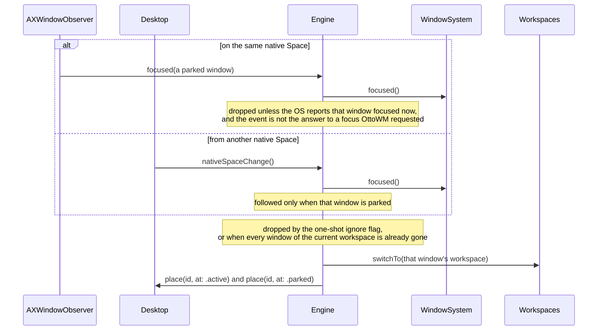

A Space change also pulls a parked window back on screen when its full screen instance exits. With no parked window focused, `Engine` answers the change with `repark`, which puts the parked windows found on screen back at the hidden edge.

### Full screen round trip

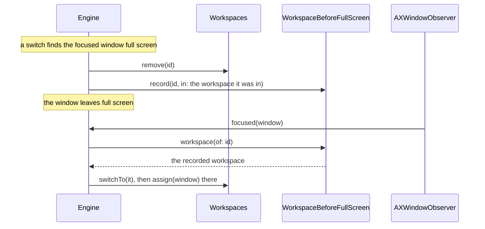

The record is taken after the removal, which clears every other trace of the window. A `move-window-to-workspace` on that window clears the record.

### Config reload

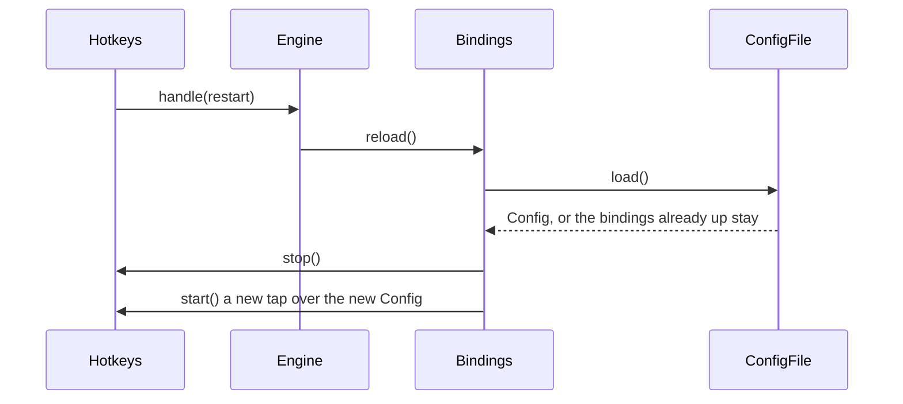

The matcher is read on the tap thread, so it is replaced with the tap rather than written under it. The engine, the workspaces and the parked windows are untouched.

### Shutdown

An `LSUIElement` agent has no quit command, so the ways out are a bound `quit` action and a signal. `Lifecycle.relaunch` is the third: it restores the frames the same way, then exits once the new instance is up.

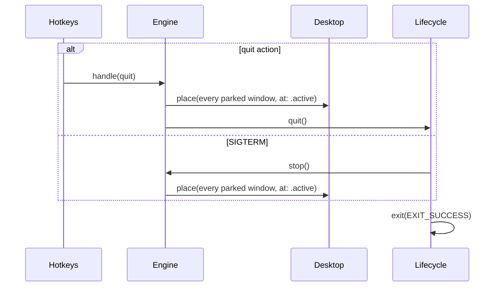

The default action for SIGTERM ends the process with every parked window still at the hidden edge. `Lifecycle.startWatchingSIGTERM` ignores the signal and takes it on a `DispatchSourceSignal` on the main queue.

### Unlock

Window events are dropped while the screen is locked, and a sweep run behind the login window reads every window as closed, so the registry and the workspaces drift apart. Unlocking closes the gap: `Lifecycle` runs both halves of the reconciliation, the removals first and the additions after.

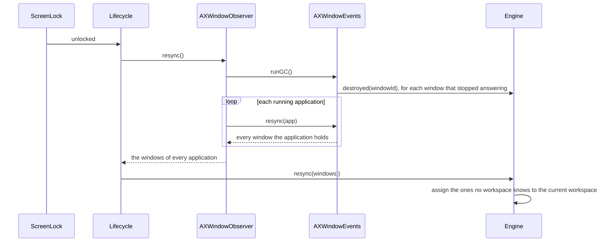

The sweep runs first: a window it drops must not come back in the answer as one to adopt again. A window is reported dead only after two passes without an answer, because an application still coming back from sleep answers for none of its windows.

The answer holds every window, not only the ones this pass attached. A window created behind the login window was attached by the notification that announced it, and only the engine dropped the event, so it reaches the workspaces solely because `Engine.resync` reads the full set and keeps what no workspace knows.

### Window lifecycle

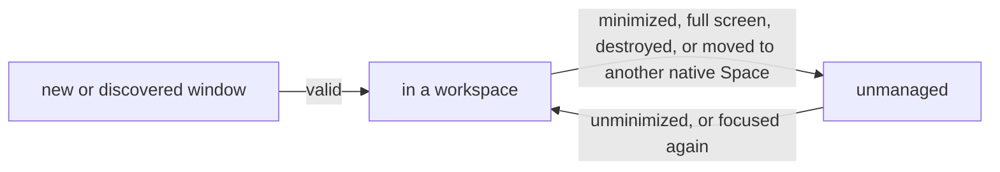

A window out of reach cannot be parked, so OttoWM stops managing it instead of marking it. A parked window on screen proves the Space in front is OttoWM's own, so the managed windows missing from that Space are the ones that left. A window that comes back joins the current workspace, like a new one. A tab of a group in another workspace is the exception: it joins the group, and the user who focused it is followed there.

## Tabbed windows

macOS reports no tab membership, so OttoWM infers it. A tab group is one window to macOS: its tabs minimize, restore and move together.

### Discovery

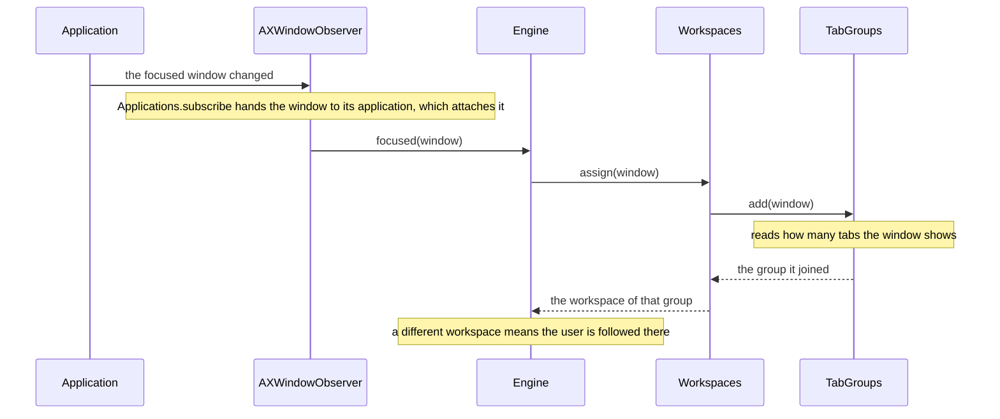

An application lists only the active tab of a group, and sends no notification when the user switches tabs. A background tab is discovered when it takes the focus, through this event or through the `Applications.subscribe` that `WindowSystem.focused()` reads through.

### Membership

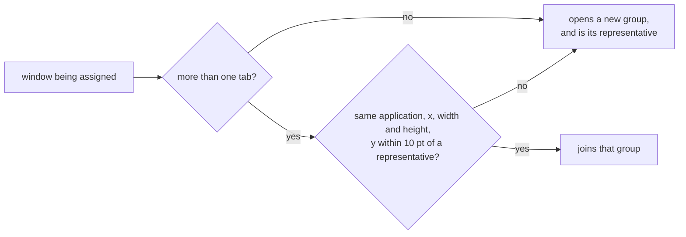

A group is keyed by a counter as macOS reuses window ids.

### Group events

| Event                                              | What OttoWM does                                                                                          |
|----------------------------------------------------|-----------------------------------------------------------------------------------------------------------|
| A tab takes the focus for the first time           | Adds it to a group, and assigns it the workspace of that group. The group does not follow the new window. |
| The group of that tab is in another workspace      | Switches to that workspace.                                                                               |
| A workspace switch, or a move to another workspace | Places every member of the group together.                                                                |
| A tab closes                                       | Drops the window. A sibling keeps the focus, so no other window is chosen.                                |
| The group is minimized                             | macOS minimizes every member and names one. Drops all of them, then picks a new window to focus.          |
