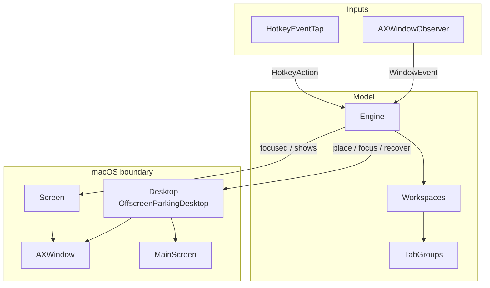
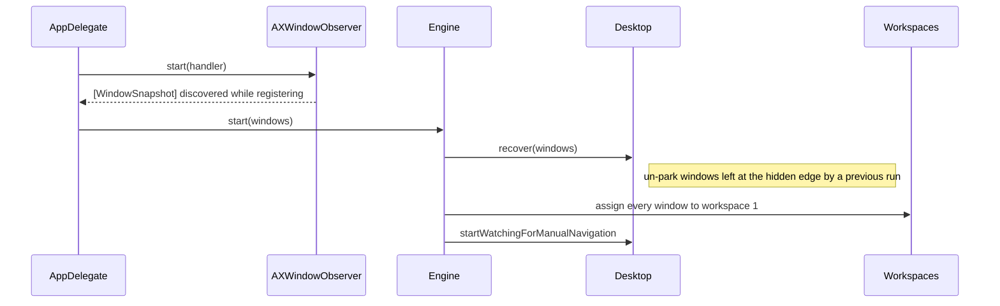
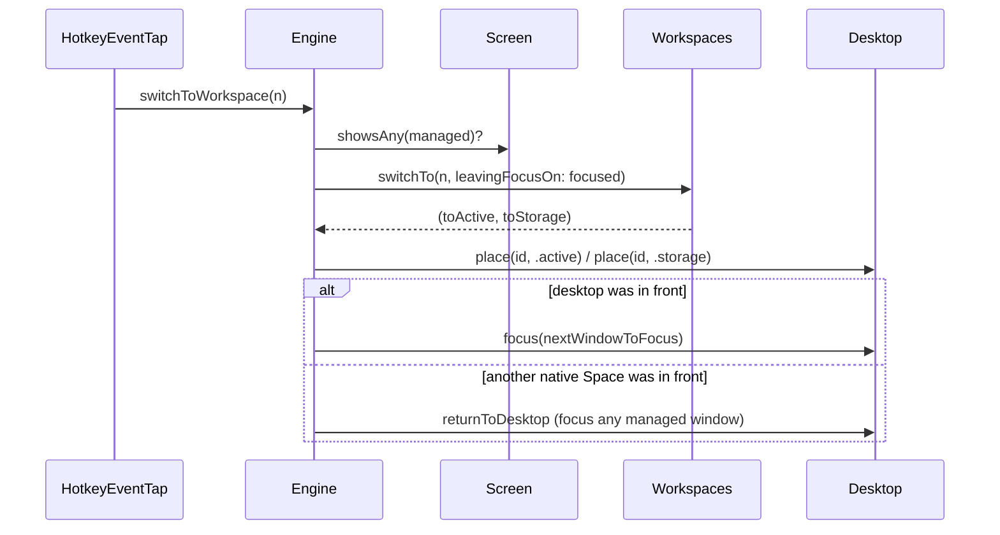
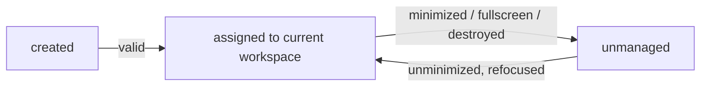

# Architecture

OttoWM is a headless agent (`App/main.swift` → `AppDelegate`) that fakes virtual workspaces on a
single native macOS Space. Everything runs on the main run loop; there is no concurrency.

## Layers



| Component | Role |
|---|---|
| `Engine` | Orchestrator. Turns events and hotkeys into model updates plus desktop moves. Owns the admission gate (`isValidWindow`). |
| `Workspaces` | Pure model: window → workspace, per-workspace focus history, current workspace. No OS calls. |
| `TabGroups` | Infers macOS tab siblings by heuristic (app name + identical frame + `tabCount > 1`); a group moves as a unit. |
| `Desktop` (`OffscreenParkingDesktop`) | The write side. Realizes `Placement` by parking storage windows in a 1px bottom-right sliver and restoring their captured frame. |
| `Screen` | The read side. Consistent, cached view of focused window and on-screen window ids. |
| `AXWindowObserver` | Per-app `AXObserver`s + `NSWorkspace` notifications → `WindowEvent`. Keeps the `AXUIElement ↔ CGWindowID` registry. |
| `HotkeyEventTap` | Session `CGEventTap` on keyDown. Needed over Carbon hotkeys because only raw device flags distinguish left from right Option. |
| `OperationCache` | Holds one AX/CG read for the duration of an engine operation; each read is an IPC round trip. |

## Key types

```
WindowEvent  = created | focused | destroyed | minimized | unminimized
HotkeyAction = switchToWorkspace(n) | moveWindowToWorkspace(n)
Placement    = active | storage
WindowSnapshot(id, appName, isStandard, isFullScreen, isMinimized, tabCount, frame)
```

Windows are identified by `CGWindowID`, obtained from the private `_AXUIElementGetWindow`.
Frames are in top-left (AX) coordinates; `MainScreen` flips Cocoa rects into that space.

## Flows

### Startup



### Workspace switch



The whole operation runs inside `Screen.duringOperation`, so the focused window and the
on-screen list are each read at most once.

### Manual navigation (Cmd-Tab / Dock / Mission Control)

The user can reach a parked window behind OttoWM's back. Two detectors, one handler:

- A `.focused` event for a window whose placement is `.storage` (same native Space).
- `activeSpaceDidChangeNotification` with a hidden window focused (from another Space).

`handleManualNavigation` then switches the model to that window's workspace, so OttoWM follows
the user rather than fighting them. A one-shot `ignoreNextManualNavigation` flag suppresses the
echo of a focus OttoWM itself caused.

### Window lifecycle



A window out of reach cannot be parked, so it stops being managed rather than being flagged.
Anything coming back joins whatever workspace is current, like a brand-new window.

## Invariants

- `isValidWindow` is the single admission gate: non-zero id, standard subrole, not fullscreen,
  not minimized, and currently on screen.
- Only `Desktop` moves windows; `Engine` never touches AX geometry directly.
- `Workspaces` is pure and fully unit-testable; `Desktop`/`Screen`/`Window` are protocols with
  stubs in `OttoWMTests`.
- A parked window's original frame lives in `OffscreenParkingDesktop.hiddenWindowFrames`;
  `forget` drops it when a window leaves management.
