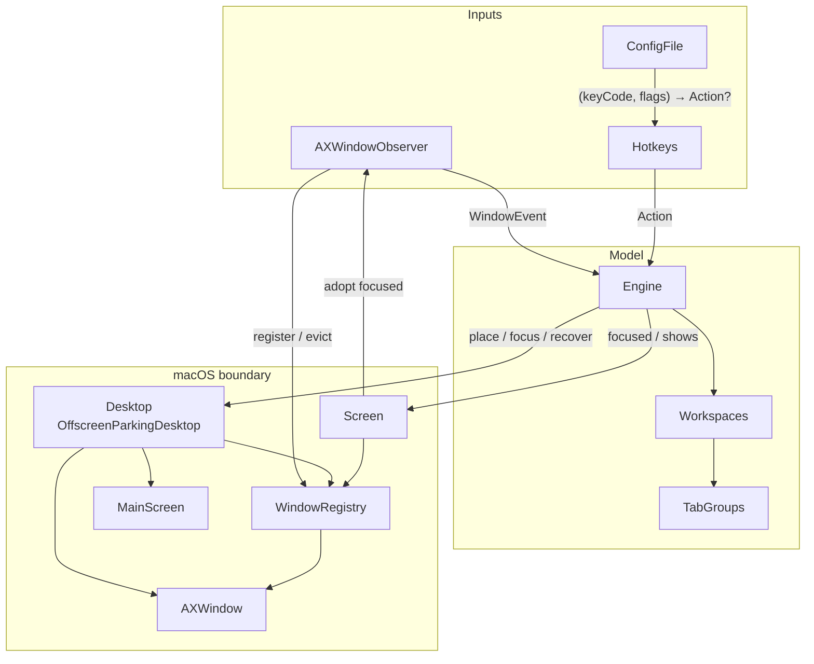
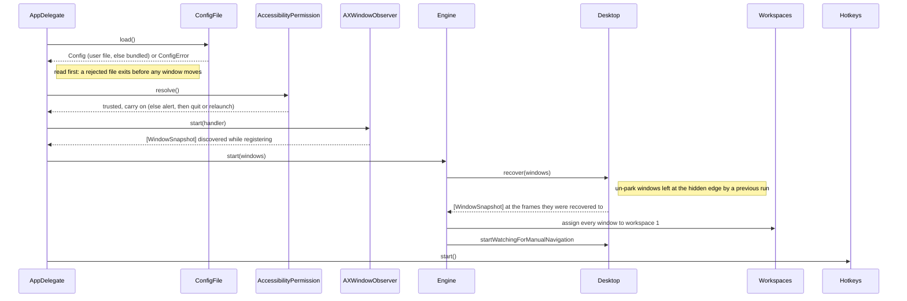
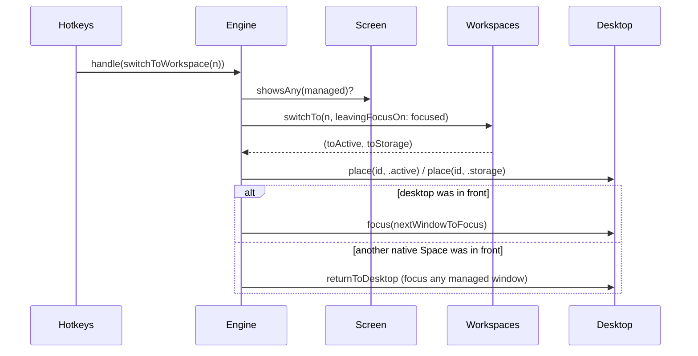
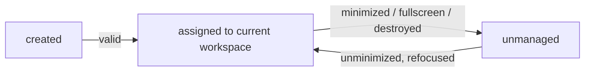

# Architecture

OttoWM is a headless agent (`App/main.swift` → `AppDelegate`) that fakes virtual workspaces on a single native macOS Space. Everything runs on the main run loop; there is no concurrency.

## Layers



| Component | Role |
|---|---|
| `Engine` | Orchestrator. Turns events and hotkeys into model updates plus desktop moves. Owns the admission gate (`isValidWindow`), which is `WindowSnapshot.isAdmissible` plus the one thing a snapshot cannot answer for itself, whether the window is on screen. |
| `Workspaces` | Pure model: window → workspace, per-workspace focus history, current workspace. No OS calls. |
| `TabGroups` | Infers macOS tab siblings by heuristic (app name + identical frame + `tabCount > 1`); a group moves as a unit and stays where it is, so a window joining one lands in the group's workspace rather than dragging the group to its own. |
| `Desktop` (`OffscreenParkingDesktop`) | The write side. Realizes `Placement` by parking storage windows in a 1px bottom-right sliver and restoring their captured frame. Every frame write goes through `Window.withoutAnimations`, since an application that thinks an assistive client is watching animates the move and answers reads with where the window was. |
| `Screen` | The read side. Consistent, cached view of focused window and on-screen window ids. |
| `AXWindowObserver` | Per-app `AXObserver`s + `NSWorkspace` notifications → `WindowEvent`. Registers every window it watches in `WindowRegistry` on the way in. An application lists only the active tab of a group in `kAXWindowsAttribute` and sends no notification when tabs switch, so a background tab cannot be enumerated at all: `adoptFocusedWindow()` takes it in at the one moment it is reachable, when it becomes focused. The `AXObserverCreate`/run-loop machinery lives behind `AXAppObserver.make`; every other OS touchpoint is an injected closure, so the translation logic is tested in `AXWindowObserverTests`. `kAXUIElementDestroyedNotification` is not delivered for a window closed by its button while its application is in the background, so `dropDeadWindows()` asks every window it knows whether it still answers at all; it runs when an application comes to front. |
| `WindowRegistry` | The map of known windows: `AXUIElement ↔ CGWindowID` plus pid → application, kept current by `AXWindowObserver`; resolves ids back to live `AXWindow`s. |
| `Hotkeys` | Session `CGEventTap` on keyDown. Needed over Carbon hotkeys because only raw device flags distinguish left from right Option. Holds only a matcher `(keyCode, flags) → Action?` (in practice `Config.action`) and hands matched `Action`s to `Engine.handle`. |
| `Config` | The binding table: `KeyCombo` → `Action`, indexed by key code because the lookup runs in the event tap callback. Nothing else; a pure value. |
| `ConfigFile` | Where the configuration comes from: `load()` resolves `$OTTOWM_CONFIG` / XDG and falls back to the copy bundled in `Contents/Resources` only when there is no user file at all. A file that is there but does not parse comes back as a `ConfigError`, which `AppDelegate` turns into an exit rather than binding keys the user did not ask for. `parse()` is the pure parser for the line format (`key combo = action`, blank lines skipped, nothing else) and stops at the first problem; a combo bound twice keeps the last line, and two different combos one keystroke could satisfy (`alt-1` and `lalt-1`) are both kept, with the lookup picking between them in no guaranteed order. `KeyCombo` and `Action` are the two halves of a line and live beside it under `Core/Config`; `KeyCombo` owns the `NX_DEVICE*` bits that pin a modifier to one side, and `ConfigError` carries the offending line. |
| `AccessibilityPermission` | The startup gate. Without the grant nothing can be read or moved, and an `LSUIElement` agent has no Dock icon or menu bar to quit from, so `resolve()` never lets the app run on silently: it offers Settings and a Quit button, taking a regular activation policy so the alert can come to front. The grant landing relaunches the app, off the undocumented `com.apple.accessibility.api` distributed notification — the second alert restarts by hand should it not fire. |
| `OperationCache` | Holds one AX/CG read for the duration of an engine operation; each read is an IPC round trip. |

## Key types

```
WindowEvent  = created | focused | destroyed | minimized | unminimized
Action       = switchToWorkspace(n) | moveWindowToWorkspace(n)   // "switch-to-workspace n" in the config
KeyCombo     = (keyCode, [ModifierKey: Side])                    // "lopt-shift-1"
Placement    = active | storage
WindowSnapshot(id, appName, isStandard, hasCloseButton, hasMinimizeButton, isFullScreen, isMinimized, frame)
```

Windows are identified by `CGWindowID`, obtained from the private `_AXUIElementGetWindow`.
Frames are in top-left (AX) coordinates; `MainScreen` flips Cocoa rects into that space.

## Flows

### Startup



### Workspace switch



The whole operation runs inside `Screen.duringOperation`, so the focused window and the on-screen list are each read at most once.

### Manual navigation (Cmd-Tab / Dock / Mission Control)

The user can reach a parked window behind OttoWM's back. Two detectors, one handler:

- A `.focused` event for a window whose placement is `.storage` (same native Space).
- `activeSpaceDidChangeNotification` with a hidden window focused (from another Space).

`handleManualNavigation` then switches the model to that window's workspace, so OttoWM follows the user rather than fighting them. A one-shot `ignoreNextManualNavigation` flag suppresses the echo of a focus OttoWM itself caused.

### Window lifecycle



A window out of reach cannot be parked, so it stops being managed rather than being flagged.  Anything coming back joins whatever workspace is current, like a brand-new window — unless it is a tab of a group living elsewhere, which wins: the window is assigned there and parked, and a user who reached it by focusing it is followed to that workspace.
