# Architecture

OttoWM is a headless agent that offers several workspaces on one native macOS Space.

## Vocabulary

| Concept        | Meaning                                                                                                       |
|----------------|---------------------------------------------------------------------------------------------------------------|
| Native Space   | A macOS space. OttoWM uses only the one it starts on. A window on another Space is ignored.                   |
| Desktop        | The native Space OttoWM controls, and the component that moves windows on it.                                 |
| Workspace      | A numbered set of windows. It exists as soon as an action names it.                                           |
| Managed window | A window that belongs to a workspace.                                                                         |
| Hidden edge    | A 1pt sliver at the bottom right of the display. A window not in the current workspace is parked there.       |
| Tab group      | The windows macOS shows as tabs of one window. See [Tabbed windows](#tabbed-windows).                         |
| Window id      | The `CGWindowID` of a window. It identifies the window for as long as the window lives.                       |
| Frame          | A rect in top-left coordinates.                                                                               |
| Operation      | One unit of engine work. The focused window and the list of on-screen window ids are read at most once in it. |

## Key types

```
WindowEvent  = created(WindowSnapshot) | focused(WindowSnapshot) | destroyed(id) | minimized(id) | unminimized(WindowSnapshot)
Action       = switchToWorkspace(n) | moveWindowToWorkspace(n) | focus(direction) | moveWindow(step)
             | centerWindow | toggleMaximize | fill(direction) | quit | restart
Direction    = north | east | south | west                       // "focus east" in the config
Step         = (direction, points)                               // "move-window east 15" in the config
KeyCombo     = (keyCode, [ModifierKey: ModifierSide])            // "lopt-shift-1"
FrameChange  = step(Step) | center | park | unpark(frame?)       // what a window's frame is asked to become
             | maximize(frame?) | fill(direction, frame?)        // carrying the frame to go back to
WindowSnapshot(id, appName, isStandard, hasCloseButton, hasMinimizeButton, isFullScreen, isMinimized, frame)
```

## Level 1: Context


## Level 2: Subsystems

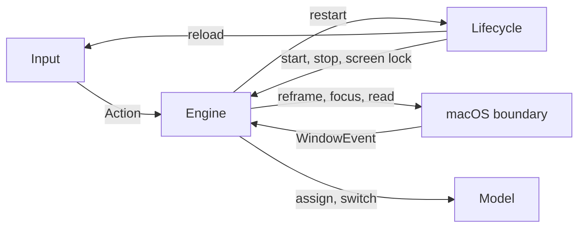

## Level 3: Components

| Component                     | Category  | Description                                                                             |
|-------------------------------|-----------|-----------------------------------------------------------------------------------------|
| `ConfigFile`                  | Input     | Reads the user's config file, or the bundled one.                                       |
| `Config`                      | Input     | The `KeyCombo → Action` table, indexed by key code.                                     |
| `Bindings`                    | Input     | The bindings currently up: `start`, `stop`, `reload`.                                   |
| `Hotkeys`                     | Input     | A session `CGEventTap` on keyDown, running on a thread of its own.                      |
| `Engine`                      | Engine    | Runs each window event and action as one operation over the five parts below.           |
| `Admission`                   | Engine    | Whether a window can be taken now, may be worth reading again, or never qualifies.      |
| `WindowPlacement`             | Engine    | Keeps a window's workspace membership and its desktop placement in step.                |
| `WindowEnrollment`            | Engine    | Enrolls a window announced before it was on screen, retrying the read for a moment.     |
| `Navigation`                  | Engine    | Restores the focus after a change, and follows the user to the workspace they focused.  |
| `FullScreenReturns`           | Engine    | Notices a window back from full screen on every event, and polls after a Space change.  |
| `Workspaces`                  | Model     | Window → workspace, focus history, current workspace.                                   |
| `Workspace`                   | Model     | The windows of one workspace and the order they were focused in.                        |
| `TabGroups`                   | Model     | Infers which windows are tabs of one another. Reads tab counts and frames on demand.    |
| `Neighbors`                   | Model     | The windows around one frame, and which of them a focus move lands on.                  |
| `Step`                        | Model     | One move of a window in points, and where it lands within the screen.                   |
| `Half`                        | Model     | One side of a rect, taking half of it, with the gap kept between the two halves.        |
| `FrameChange`                 | Model     | What a window's frame is asked to become: step, center, maximize, fill, park or unpark. |
| `ParkedWindows`               | Model     | The windows parked at the hidden edge, and the frame each one was parked from.          |
| `FilledWindows`               | Model     | The frame each filled window goes back to, shared by the tabs of one window.            |
| `Desktop`                     | macOS     | Manipulates the current workspace's windows.                                            |
| `HiddenEdge`                  | macOS     | Where a parked window sits, and whether a frame sits there.                             |
| `WindowSystem`                | macOS     | The focused window, the on-screen window frames, and the tab count of a window.         |
| `RunningApplicationsObserver` | macOS     | Which applications count, and the `NSWorkspace` notifications of their lifecycle.       |
| `AXWindowEvents`              | macOS     | The AX notifications of the watched applications, as `WindowEvent`s.                    |
| `Applications`                | macOS     | The applications watched, and the window each `CGWindowID` belongs to.                  |
| `Application`                 | macOS     | One watched application: its channel and subscription, the windows it reads, their ids. |
| `Subscription`                | macOS     | The AX notifications one element is subscribed to, and whether the attempt succeeded.   |
| `AXNotifications`             | macOS     | The AX notification channel of one process: subscribe an element, invalidate the lot.   |
| `Window`                      | macOS     | The window operations the desktop needs: snapshot, frames, moves, focus, tabs.          |
| `AXWindow`                    | macOS     | One window: snapshot, frame writes, focus, tab count.                                   |
| `MainScreen`                  | macOS     | The geometry of the main display, in top-left coordinates.                              |
| `OperationCache`              | macOS     | Holds one AX or CG read for the length of an operation.                                 |
| `RoundTrips`                  | macOS     | Prices an operation in the calls it makes out of the process: how many, of what, cost.  |
| `Signposts`                   | macOS     | The operation and round-trip intervals Instruments records.                             |
| `AppDelegate`                 | Lifecycle | The startup order.                                                                      |
| `ConfigGate`                  | Lifecycle | The config startup gate: the error alert, and whether to relaunch or quit.              |
| `AccessibilityPermission`     | Lifecycle | The startup gate, and the watch on the accessibility trust.                             |
| `ScreenLock`                  | Lifecycle | Reports whether the login window covers the session, and when it is uncovered.          |
| `Lifecycle`                   | Lifecycle | The transitions once it owns windows: `quit`, SIGTERM, relaunch, reload, unlock.        |
| `AccessibilityAlert`          | UI        | The accessibility permission alerts: what they say and how they show.                   |
| `ConfigAlert`                 | UI        | The config error alert UI.                                                              |

`Window` is a protocol; `AXWindow` is the implementation the app runs.

`Desktop` is a protocol; `OffscreenParkingDesktop` is the implementation the app runs. It holds no state of its own. `WindowPlacement` hands it a park or an unpark per window, the unpark carrying the frame the window was parked from, and records what comes back in `ParkedWindows`. `Engine` hands it a step, a centering, a maximize or a fill of the focused window, the maximize and the fill carrying the frame to go back to, and records what comes back in `FilledWindows`.

### Input

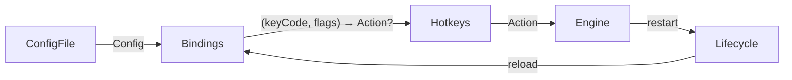

The tap thread matches the key and dispatches the action to the main queue, the only thread the accessibility writes are allowed on.

### Engine and model

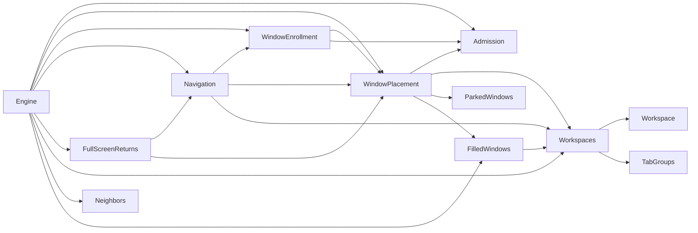

Every window event, and every action that touches windows, runs inside `WindowSystem.duringOperation`. Only an entry point opens an operation: an `Engine` method, the native Space change callback, or a retry closure of `WindowEnrollment` and `FullScreenReturns`. The parts never open one. Events are dropped while the screen is locked, where every window reads as closed.

`Admission` answers whether OttoWM can take a window: refused for good when the window's own shape rules it out, worth reading again when only the desktop in front or the on-screen list does. `WindowPlacement` owns a window's workspace: every change of it is paired with a park or an unpark on the `Desktop`. `Navigation` decides where the focus goes after a change and which workspace to show when the user focuses a window. `WindowEnrollment` and `FullScreenReturns` repeat a read macOS sent no notification for.

### macOS boundary

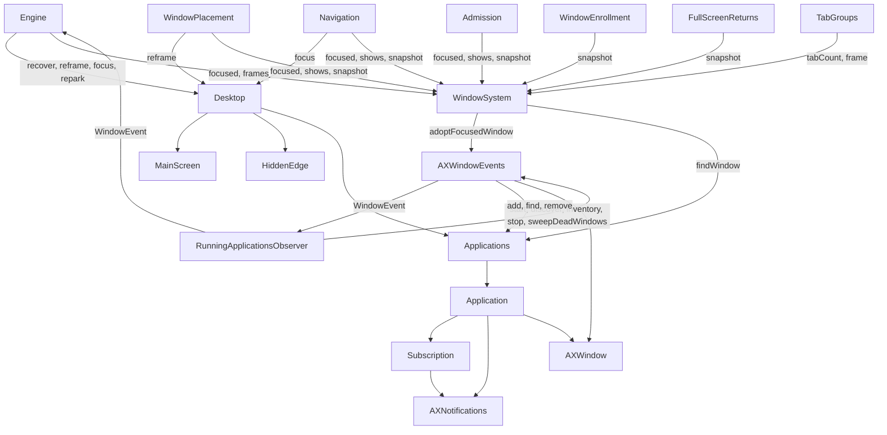

`AXWindowEvents` pushes only what nobody asked for: the AX notifications of the watched applications and the sweep. A scan, `start`, `discover` or `inventory`, answers with what it found, and `RunningApplicationsObserver` decides what to announce.

### Lifecycle

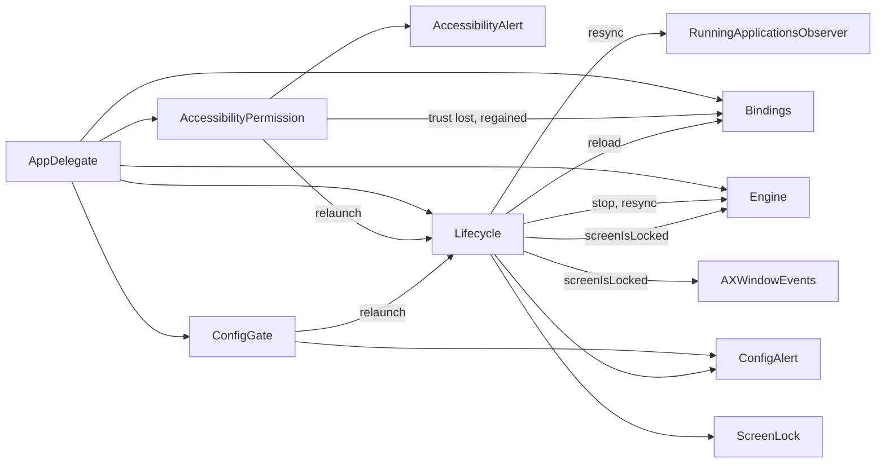

## Flows

### Startup

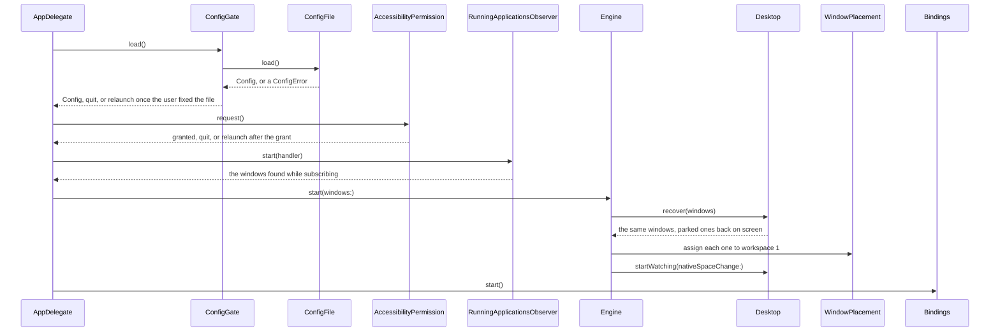

### Workspace switch

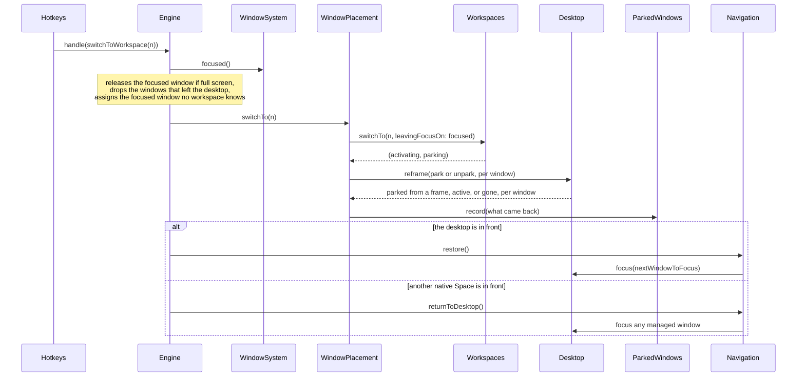

A window the desktop reports gone is no longer managed.

### Move window to workspace

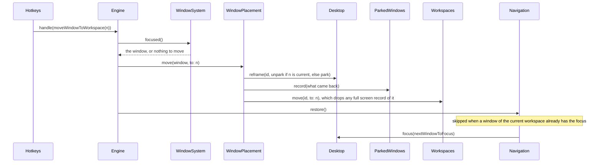

### Focus a neighbour window

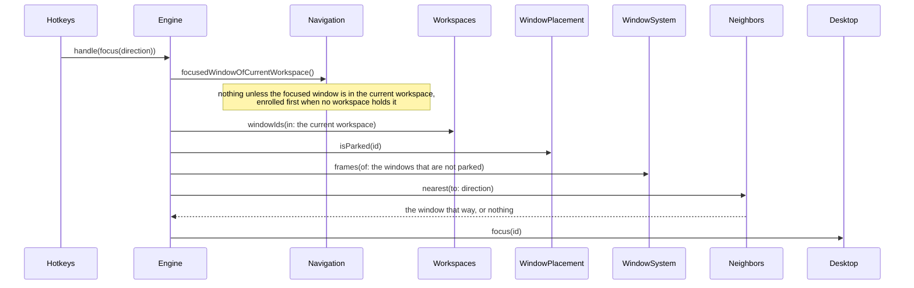

### Move, center, maximize or fill the focused window

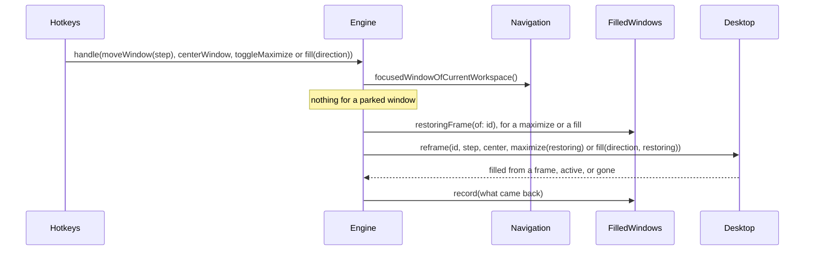

A maximize targets the visible frame inset by 15pt, a fill one half of that frame, the two halves of an axis leaving the same gap between them. A window not already at the target takes it and reports the frame it left; one already there goes back to the frame handed in, and with none it is left alone. A window within 30pt of the target on every edge is read as standing there: a window settles short of the frame it was given, Terminal by whole rows. One record serves every target, so filling west and then maximizing moves the window on rather than restoring it, and the frame recorded stays the one from before the first fill. A step or a centering ends the fill; a park does not, so the frame survives a workspace switch. The tabs of one window share the frame, and a tab that joins a filled window takes it, so the frame outlives the tab the fill went through.

### Manual navigation

The user can reach a parked window without OttoWM, through Cmd-Tab, the Dock or Mission Control.

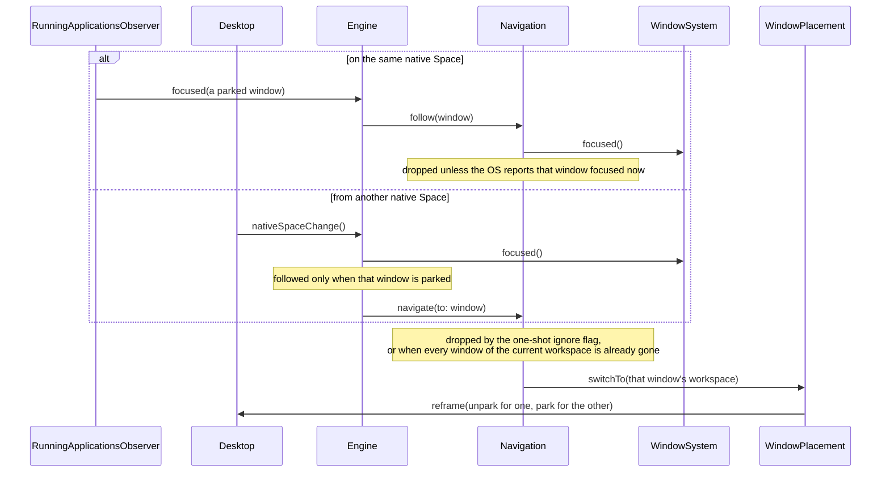

A Space change also pulls a parked window back on screen when its full screen instance exits. With no parked window focused, `Engine` answers the change with `repark`, which puts the parked windows found on screen back at the hidden edge.

### Full screen round trip

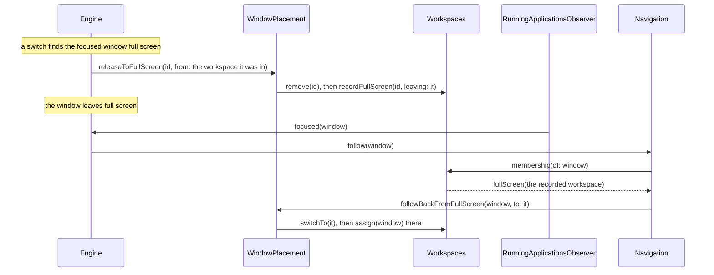

The record is taken after the removal, which clears every other trace of the window. A `move-window-to-workspace` on that window clears the record. The focus event can arrive while the window still reads as full screen and is dropped then; `FullScreenReturns` runs the same follow-back at the start of every later window event, and polls for it after a native Space change until the retries run out.

### Config reload

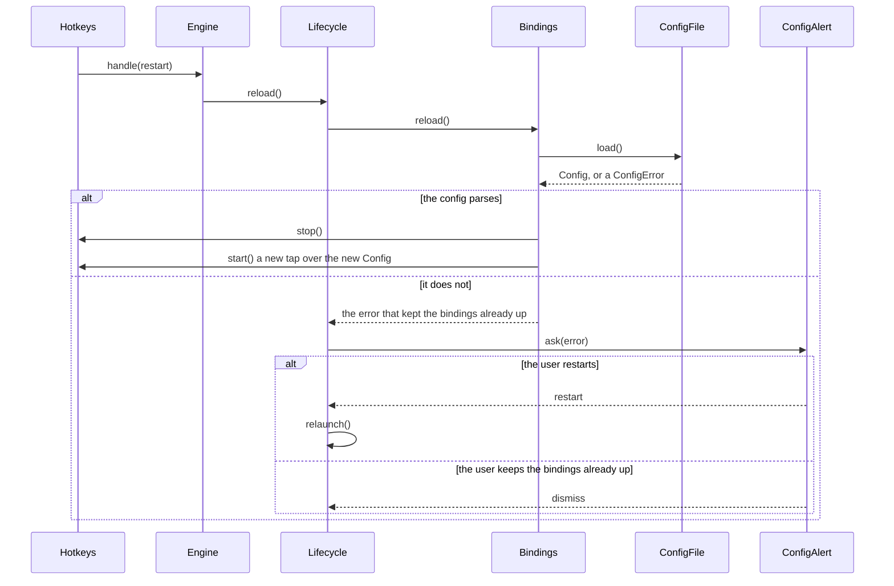

The matcher is read on the tap thread, so it is replaced with the tap rather than written under it. The engine, the workspaces and the parked windows are untouched.

### Shutdown

An `LSUIElement` agent has no quit command, so the ways out are a bound `quit` action and a signal. `Lifecycle.relaunch` is the third: it restores the frames the same way, then exits once the new instance is up.

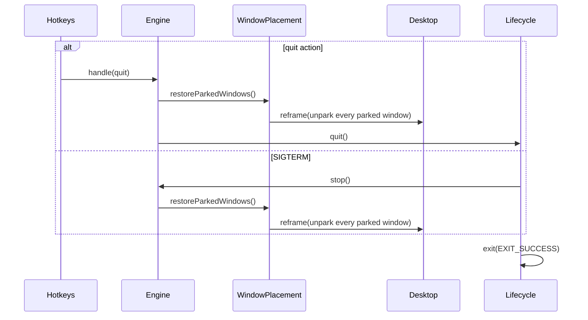

The default action for SIGTERM ends the process with every parked window still at the hidden edge. `Lifecycle.startWatchingSIGTERM` ignores the signal and takes it on a `DispatchSourceSignal` on the main queue.

### Unlock

Window events are dropped while the screen is locked, and a sweep run behind the login window reads every window as closed, so the registry and the workspaces drift apart. Unlocking closes the gap: `Lifecycle` runs the removals first and the additions after.

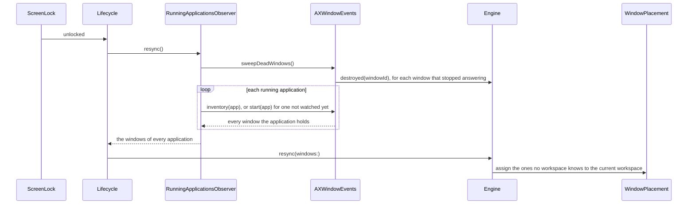

The sweep runs first, so a window it drops does not come back in the answer as one to enroll again. A window is reported dead only after two passes without an answer: an application still waking from sleep answers for none of its windows.

The answer holds every window, not only the ones this pass attached. A window created behind the login window was attached by the notification that announced it and only the engine dropped the event, so `Engine.resync` reads the full set and keeps what no workspace knows.

An application that appeared behind the login window is not watched yet, so `RunningApplicationsObserver` starts it the way a launch does, retrying one that does not answer until the grace period runs out.

### Window lifecycle

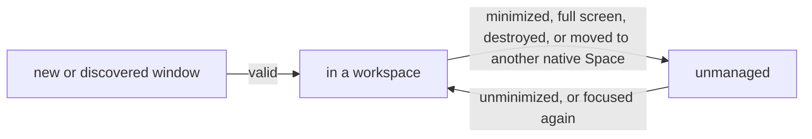

A window out of reach cannot be parked, so OttoWM stops managing it instead of marking it. A parked window on screen proves the Space in front is OttoWM's own, so the managed windows missing from that Space are the ones that left. A window that comes back joins the current workspace, like a new one. A tab of a group in another workspace is the exception: it joins the group, and the user who focused it is followed there.

## Tabbed windows

macOS reports no tab membership, so OttoWM infers it. A tab group is one window to macOS: its tabs minimize, restore and move together.

### Discovery

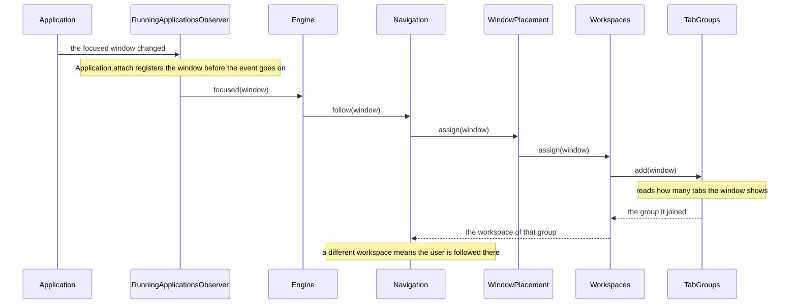

An application lists only the active tab of a group, and sends no notification when the user switches tabs. A background tab is discovered when it takes the focus, through this event or through `AXWindowEvents.adoptFocusedWindow`, which `WindowSystem.focused()` reads through.

### Membership

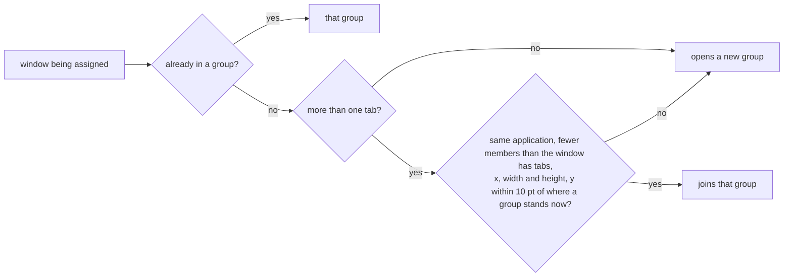

A group is keyed by a counter as macOS reuses window ids. Where a group stands is read from its members at each match, since a maximize or a move has moved it since the group was first seen. A background tab reports the frame it had when it was last active, so every member is tried.

Two maximized windows stand at one frame, so the frame alone matches either group. A group already holding as many windows as the tab reports tabs is full, and the tab of the other window opens its own group.

### Group events

| Event                                              | What OttoWM does                                                                                          |
|----------------------------------------------------|-----------------------------------------------------------------------------------------------------------|
| A tab takes the focus for the first time           | Adds it to a group, and assigns it the workspace of that group. The group does not follow the new window. |
| The group of that tab is in another workspace      | Switches to that workspace.                                                                               |
| A workspace switch, or a move to another workspace | Places every member of the group together.                                                                |
| A tab closes                                       | Drops the window. A sibling keeps the focus, so no other window is chosen.                                |
| The group is minimized                             | macOS minimizes every member and names one. Drops all of them, then picks a new window to focus.          |
