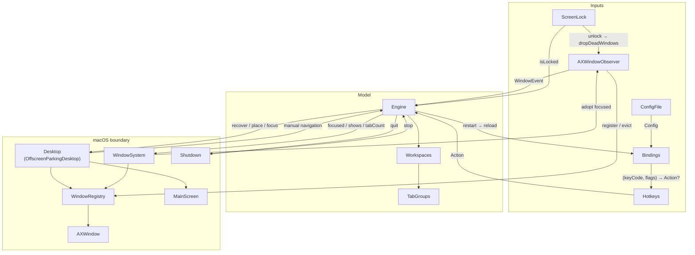
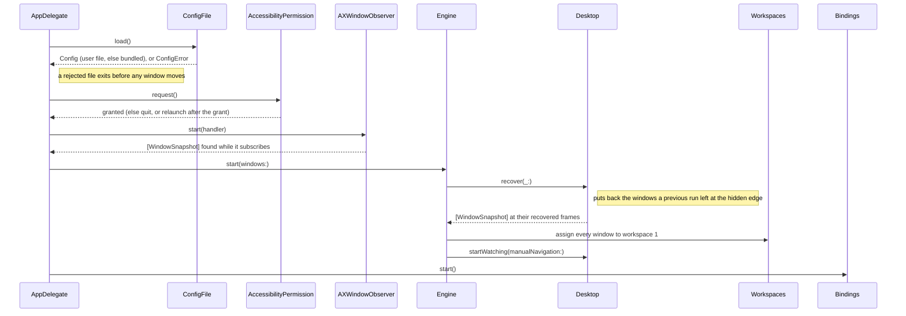
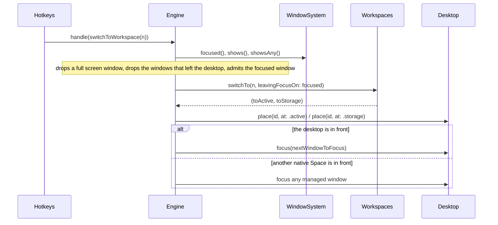
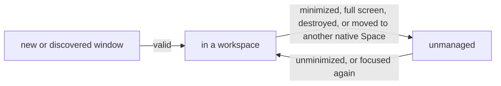

# Architecture

OttoWM is a headless agent. It offers several workspaces on one native macOS Space. All window work runs on the main run loop, but the hotkey event tap has a thread of its own, and it hands each action back to the main queue.

## Concepts

| Concept        | Meaning                                                                                                                                            |
|----------------|----------------------------------------------------------------------------------------------------------------------------------------------------|
| Native Space   | A macOS space. OttoWM uses only the one it starts on. A window on another Space is out of reach, so OttoWM stops managing it.                      |
| Desktop        | The native Space OttoWM controls, and the component that moves windows on it.                                                                      |
| Workspace      | A numbered set of windows. A workspace exists as soon as an action names it. Only the current workspace shows its windows.                         |
| Managed window | A window that belongs to a workspace.                                                                                                              |
| Placement      | Where a managed window sits: `active` on screen, or `storage` at the hidden edge.                                                                  |
| Hidden edge    | A 1 pt sliver at the bottom-right corner of the display. A storage window is parked there. OttoWM keeps its on-screen frame and restores it later. |
| WindowSystem   | The read side of macOS: which window has the focus, and which window ids are on screen.                                                            |
| Tab group      | The windows macOS shows as tabs of one window. See [Tabbed windows](#tabbed-windows).                                                              |
| Window id      | The `CGWindowID` from the private `_AXUIElementGetWindow`. It identifies a window for as long as the window lives.                                 |
| Frame          | A rect in top-left (AX) coordinates. `MainScreen` flips Cocoa rects into that space.                                                               |
| Operation      | One unit of engine work. The focused window and the list of on-screen window ids are read at most once in it.                                      |

## Layers



| Component                             | Role                                                                                                                                                                                                                                                                                                                                                                                                                       |
|---------------------------------------|----------------------------------------------------------------------------------------------------------------------------------------------------------------------------------------------------------------------------------------------------------------------------------------------------------------------------------------------------------------------------------------------------------------------------|
| `Engine`                              | Turns window events and actions into model updates and window moves.                                                                                                                            |
| `Workspaces`                          | The pure model: window → workspace, focus history per workspace, current workspace. It makes no OS call.                                                                                                                                                                                                                                                                                                                   |
| `TabGroups`                           | Infers which windows are tabs of one another.                                                                                                                                                                                                                                                                                                                                                                              |
| `Desktop` (`OffscreenParkingDesktop`) | It parks a storage window at the hidden edge and restores the captured frame. `restoreAll()` puts every parked window back.                                                                         |
| `WindowSystem`                        | It caches the focused window and the on-screen window ids for the length of an operation.                                                                                                                                                                                                                                                                                                                   |
| `MainScreen`                          | The geometry of the main display, in top-left coordinates.                                                                                                                                                                                                                                                                                                                                                                 |
| `AXWindowObserver`                    | Per-application `AXObserver`s and `NSWorkspace` notifications, translated into `WindowEvent`s. It registers each window it watches. `dropDeadWindows()` probes the known windows, because macOS sends no destroyed notification when the close button removes a window of a background application. The `AXObserverCreate` and run-loop code sits behind `AXAppObserver.make`; every other OS call is an injected closure. |
| `WindowRegistry`                      | The map of known windows: `AXUIElement` ↔ `CGWindowID`, plus pid → application. It resolves an id back to a live `AXWindow`.                                                                                                                                                                                                                                                                                               |
| `AXWindow`                            | One window behind the accessibility API: snapshot, frame writes, focus, tab count.                                                                                                                                                                                                                                                                                                                                         |
| `Hotkeys`                             | A session `CGEventTap` on keyDown. Carbon hotkeys are not enough, because only the raw device flags tell the left modifier from the right one. It holds a matcher `(keyCode, flags) → Action?` and sends each match to `Engine.handle`.                                                                                                                                                                                    |
| `Bindings`                            | The bindings currently up: the `Hotkeys` tap over one `Config`. `start()` and `stop()` follow the accessibility trust, and `reload()` reads the file again and replaces the tap. `Bindings.system` builds the tap; the two calls it makes are the seam, because `Hotkeys.start()` creates a real event tap.                                          |
| `Shutdown`                            | Every way the process ends: the `quit` action and SIGTERM. `quit()` only exits, because `Engine.handle(.quit)` restores the windows before calling it; the signal handler restores them itself.                                                                                                                                                |
| `Config`                              | The binding table `KeyCombo → Action`, indexed by key code, because the lookup runs inside the event tap callback.                                                                                                                                                                                                                                                                                                         |
| `ConfigFile`                          | Reads `$XDG_CONFIG_HOME/ottowm/ottowm`, or `~/.config/ottowm/ottowm`. It falls back to the bundled copy only when the user has no file. A file that does not parse returns a `ConfigError`: `AppDelegate` exits on the launch read, and `Bindings` keeps the bindings already up on a reload. `ConfigFileParser` stops at the first bad line.                                                                                         |
| `AccessibilityPermission`             | The startup gate. `request()` offers Settings and Quit, and relaunches the app when the grant lands. `startWatchingTrust` stops the event tap when the grant is revoked, and starts it again when it returns.                                                                                                                                                                                                              |
| `ScreenLock`                          | Reports whether the login window covers the session, from the `com.apple.screenIsLocked` and `com.apple.screenIsUnlocked` notifications.                                                                                                                                                                                                                                                                                   |
| `OperationCache`                      | Holds one AX or CG read for the length of an operation. Each read is an IPC round trip.                                                                                                                                                                                                                                                                                                                                    |

## Key types

```
WindowEvent  = created(WindowSnapshot) | focused(WindowSnapshot) | destroyed(id) | minimized(id) | unminimized(WindowSnapshot)
Action       = switchToWorkspace(n) | moveWindowToWorkspace(n) | quit | restart   // "switch-to-workspace n" in the config
KeyCombo     = (keyCode, [ModifierKey: ModifierSide])            // "lopt-shift-1"
Placement    = active | storage
WindowSnapshot(id, appName, isStandard, hasCloseButton, hasMinimizeButton, isFullScreen, isMinimized, frame)
```

## Flows

### Startup



`AppDelegate` also sets a process-wide AX messaging timeout, because a hung application blocks the main thread for the length of each round trip.

### Shutdown

An `LSUIElement` agent has no quit command, so the ways out are a bound `quit` action and a signal. `Engine.handle(.quit)` calls `Engine.stop` and then `Shutdown.quit`, which ends the process. The hotkey handler already runs on the main queue, the only thread where the accessibility writes are allowed.

The default action for `SIGTERM` ends the process with every parked window still at the hidden edge. `Shutdown.startWatchingSIGTERM` ignores the signal and takes it on a `DispatchSourceSignal` on the main queue. That handler calls `Engine.stop` itself, which calls `Desktop.restoreAll()`.

### Config reload

`Engine.handle(.restart)` calls the `restart` closure `AppDelegate` injected, which is `Bindings.reload()`. It reads the file again and replaces the event tap: `stop()`, a new `Hotkeys` over the new `Config`, `start()`. The matcher is read on the tap thread, so it is replaced with the tap rather than written under it. The `Engine`, the workspaces and the parked windows are untouched, only what the keys are bound to changes.

### Workspace switch



The whole switch runs inside `WindowSystem.duringOperation`, so the focused window and the on-screen list are each read once. A window that `Desktop.place` cannot reach is no longer managed.

### Manual navigation (Cmd-Tab, Dock, Mission Control)

The user can reach a parked window without OttoWM. Two detectors report it:

- A `.focused` event for a window whose placement is `.storage`, on the same native Space. The event counts only when the OS still reports that window as focused, and when it is not the late answer to a focus OttoWM asked for.
- `activeSpaceDidChangeNotification` while a parked window has the focus, from another Space.

`handleManualNavigation` then switches the model to that window's workspace. The one-shot `ignoreNextManualNavigation` flag drops the echo of a focus OttoWM caused itself. A space change also pulls a parked window back on screen when its full screen instance exits, so the desktop parks such a window again.

### Full screen

A full screen window is not admissible, and OttoWM never places it. When a switch finds the focused window in full screen, the engine stops managing it and records the workspace it was in. When the window comes back, the engine switches to that workspace and assigns the window there. A `move-window-to-workspace` on that window clears the record.

### Window lifecycle



A window out of reach cannot be parked, so OttoWM stops managing it instead of marking it. A parked window on screen proves that the Space in front is OttoWM's own, so the managed windows missing from that Space are the ones that left. A window that comes back joins the current workspace, like a new one. A tab of a group in another workspace is the exception: it joins the group, and the user who focused it is followed there.

## Tabbed windows

macOS reports no tab membership, so OttoWM infers it. A tab group is one window to macOS: its tabs minimize, restore and move together.

- **Discovery.** An application lists only the active tab of a group in `kAXWindowsAttribute`, and sends no notification when the user switches tabs. A background tab is reachable only when it takes the focus. `WindowSystem.focused()` therefore reads through `AXWindowObserver.adoptFocusedWindow()`, which registers the window and subscribes it to the window notifications.
- **Membership.** `AXWindow.tabCount()` counts the radio buttons of the first `AXTabGroup` child. A window with more than one tab joins the first group whose representative window has the same application name, the same x, the same width and height, and a y within 10 pt. Any other window opens a new group and becomes its representative.
- **Group id.** A group is keyed by a counter, not by a window id, because macOS reuses window ids and a group outlives its representative.
- **Placement.** `Workspaces` assigns every member of a group together. A window that joins a group lands in the workspace of the group. The group does not follow the new window.
- **Follow the user.** When the new tab belongs to a group in another workspace, the engine switches to that workspace.
- **Minimize.** macOS minimizes the whole group and names one window. The engine stops managing every member, then picks a new window to focus.
- **Close.** When a tab closes, a sibling keeps the focus, so the engine does not choose another window.
