# Architecture

OttoWM is a headless agent that offers several workspaces on the native macOS Space of each display.

## Vocabulary

| Concept        | Meaning                                                                                                                                                                             |
|----------------|-------------------------------------------------------------------------------------------------------------------------------------------------------------------------------------|
| Native Space   | A macOS space. OttoWM uses one per display, the one in front when it starts or when the display is added. A window on another Space is ignored.                                     |
| Desktop        | The native Space OttoWM controls on one display, and the component that moves windows on it.                                                                                        |
| Workspace      | A numbered set of windows. It exists as soon as an action names it.                                                                                                                 |
| Managed window | A window that belongs to a workspace.                                                                                                                                               |
| Display        | A connected display, identified across plugs by its CoreGraphics UUID. The primary display is the first `NSScreen.screens` returns.                                                 |
| Arrangement    | The connected displays, the primary first. A frame is on the display that holds the larger part of it, the rule macOS uses to give a window a Space, else on the nearest one.       |
| Active display | The display of the focused window, else the one `NSScreen.main` returns. Bindings act on it.                                                                                        |
| Hidden edge    | A 1pt sliver at the bottom right of a display. Windows not in the current workspace park there.                                                                                     |
| Tab group      | The windows macOS shows as tabs of one window. See [Tabbed windows](#tabbed-windows).                                                                                               |
| Window id      | The `CGWindowID` of a window, stable for the window's life.                                                                                                                         |
| Frame          | A rect in top-left coordinates.                                                                                                                                                     |
| Operation      | One unit of engine work. The focused window and the on-screen window list are read at most once in it.                                                                              |

## Level 1: System context

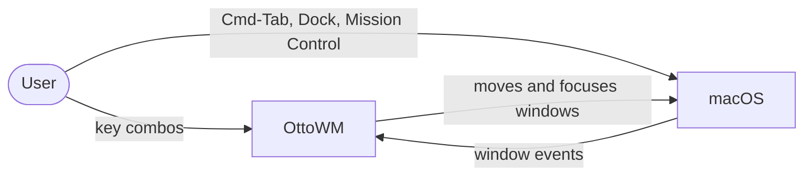
```mermaid
flowchart LR
    user([User])
    otto["OttoWM"]
    macos["macOS"]

    user -->|key combos| otto
    user -->|Cmd-Tab, Dock, Mission Control| macos
    otto -->|moves and focuses windows| macos
    macos -->|window events| otto
```

## Level 2: Containers

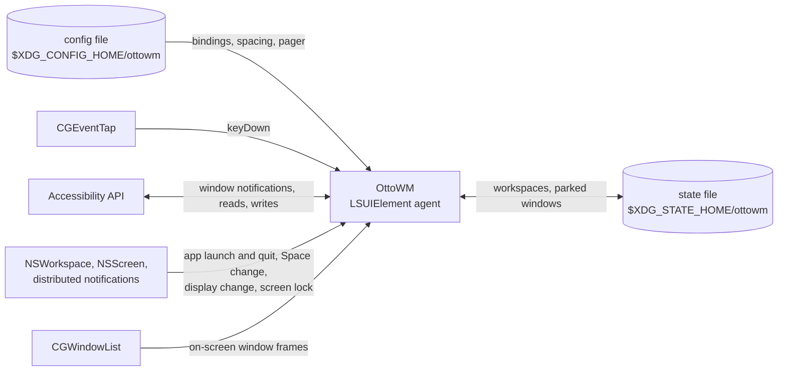
```mermaid
flowchart LR
    config[("config file<br/>$XDG_CONFIG_HOME/ottowm")]
    state[("state file<br/>$XDG_STATE_HOME/ottowm")]
    otto["OttoWM<br/>LSUIElement agent"]
    ax["Accessibility API"]
    tap["CGEventTap"]
    ws["NSWorkspace, NSScreen,<br/>distributed notifications"]
    cg["CGWindowList"]

    config -->|bindings, spacing, pager| otto
    otto <-->|workspaces, parked windows| state
    tap -->|keyDown| otto
    ax <-->|window notifications, reads, writes| otto
    ws -->|app launch and quit, Space change,<br/>display change, screen lock| otto
    cg -->|on-screen window frames| otto
```

## Level 3: Components

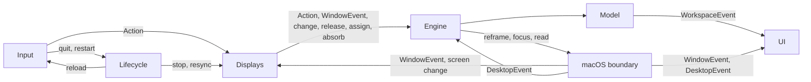
```mermaid
flowchart LR
    Input -->|Action| Displays
    Input -->|quit, restart| Lifecycle
    Lifecycle -->|reload| Input
    Lifecycle -->|stop, resync| Displays
    macOS["macOS boundary"] -->|WindowEvent, screen change| Displays
    Displays -->|"Action, WindowEvent, change, release, assign, absorb"| Engine
    macOS -->|DesktopEvent| Engine
    Engine -->|reframe, focus, read| macOS
    Engine --> Model
    Model -->|WorkspaceEvent| UI
    macOS -->|WindowEvent, DesktopEvent| UI
```

`Displays` holds one `Engine` per connected display. `AppDelegate` builds every component and wires them with closures; the diagrams show the calls made after startup.

```
Action         = switchToWorkspace(n) | moveWindowToWorkspace(n) | focus(direction) | moveWindow(direction)
               | resize(change) | centerWindow | maximize | tile(direction)
Binding        = action(Action) | quit | restart | about
WindowEvent    = created(snapshot) | focused(snapshot) | destroyed(id) | minimized(id) | unminimized(snapshot)
               | reframed(id?)
DesktopEvent   = nativeSpaceChange | displayChange(from: Display, to: Display) | screenParametersChange
WorkspaceEvent = switched(n)
```

### Input

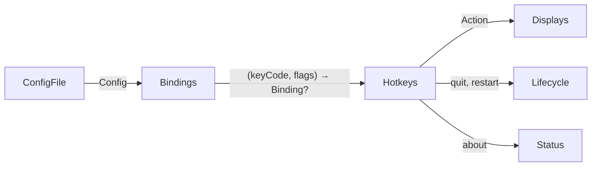
```mermaid
flowchart LR
    ConfigFile -->|Config| Bindings
    Bindings -->|"(keyCode, flags) → Binding?"| Hotkeys
    Hotkeys -->|Action| Displays
    Hotkeys -->|quit, restart| Lifecycle
    Hotkeys -->|about| Status
```

The tap thread matches the key and dispatches to the main queue, the only queue allowed to write through Accessibility.

### Displays

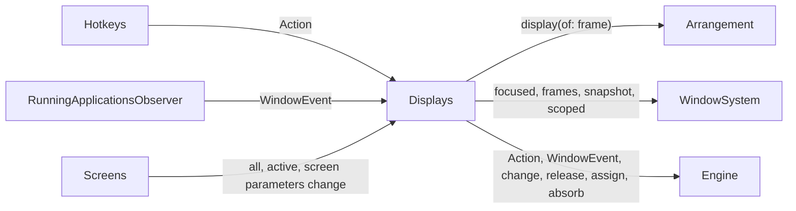
```mermaid
flowchart LR
    Hotkeys -->|Action| Displays
    RunningApplicationsObserver -->|WindowEvent| Displays
    Screens -->|"all, active, screen parameters change"| Displays
    Displays -->|"display(of: frame)"| Arrangement
    Displays -->|"focused, frames, snapshot, scoped"| WindowSystem
    Displays -->|"Action, WindowEvent, change, release, assign, absorb"| Engine
```

`AppDelegate` hands `Displays` a closure that builds the `ParkingDesktop`, `Workspaces`, `Engine` and `Pager` of one display, called for each display at launch, the primary first, and for each display added later. Each engine gets a `WindowSystem` scoped to its display: `focused()`, `shows`, `showsAny` and `frames(of:)` leave out windows whose larger part is on another display, while the reads of one window by id are not scoped. The scoped copies share the caches, so one operation still reads the focused window and the on-screen list once.

Per display: `Engine` and its parts, `Workspaces`, `ParkedWindows`, `OriginalFrames`, `ParkingDesktop`, `SpaceAnchor`, `Pager`. Shared: `DisplayLayouts`, the `WindowSystem` caches, and everything outside the engine.

### Engine and model

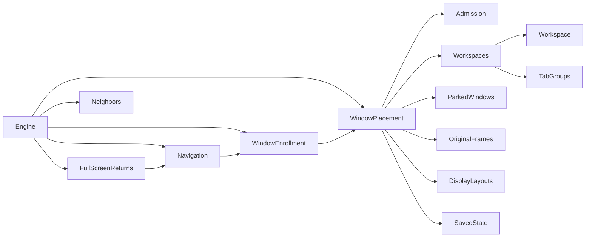
```mermaid
flowchart LR
    Engine --> Navigation & FullScreenReturns & WindowEnrollment & WindowPlacement
    Engine --> Neighbors
    FullScreenReturns --> Navigation
    Navigation --> WindowEnrollment --> WindowPlacement
    WindowPlacement --> Admission
    WindowPlacement --> Workspaces & ParkedWindows & OriginalFrames & DisplayLayouts & SavedState
    Workspaces --> Workspace & TabGroups
```

Every engine component reads the focused window and snapshots through `WindowSystem`, and membership from `Workspaces`. `TabGroups` reads tab counts and frames through `WindowSystem` when a window is assigned.

### macOS boundary

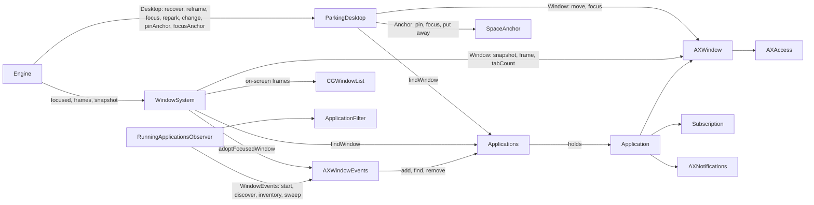
```mermaid
flowchart LR
    Engine -->|"Desktop: recover, reframe, focus, repark, change, pinAnchor, focusAnchor"| ParkingDesktop
    Engine -->|focused, frames, snapshot| WindowSystem

    ParkingDesktop -->|findWindow| Applications
    ParkingDesktop -->|"Window: move, focus"| AXWindow
    ParkingDesktop -->|"Anchor: pin, focus, put away"| SpaceAnchor

    WindowSystem -->|adoptFocusedWindow| AXWindowEvents
    WindowSystem -->|on-screen frames| CGWindowList
    WindowSystem -->|findWindow| Applications
    WindowSystem -->|"Window: snapshot, frame, tabCount"| AXWindow

    RunningApplicationsObserver --> ApplicationFilter
    RunningApplicationsObserver -->|"WindowEvents: start, discover, inventory, sweep"| AXWindowEvents
    AXWindowEvents -->|add, find, remove| Applications
    Applications -->|holds| Application
    Application --> Subscription & AXNotifications & AXWindow
    AXWindow --> AXAccess
```

`Desktop`, `WindowSystem`, `Window` and `Screens` belong to the engine; their `.system` values and `ParkingDesktop` live in `MacOS/`. `ParkingDesktop` and `WindowSystem` get `Applications.findWindow` as a closure. `ParkingDesktop` reads no screen: it is handed its display, and computes target frames with `WorkArea` and `HiddenEdge`.

`AXWindowEvents` pushes the AX notifications and the sweep. A scan (`start`, `discover`, `inventory`) returns what it found, and `RunningApplicationsObserver` decides what to announce.

### Lifecycle

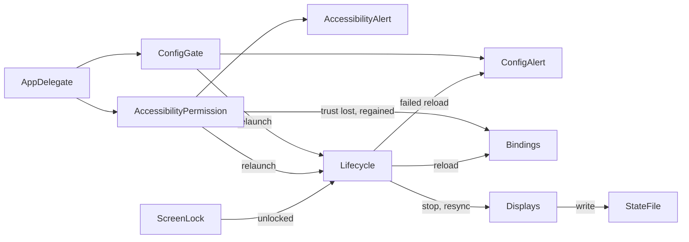
```mermaid
flowchart LR
    AppDelegate --> ConfigGate --> ConfigAlert
    AppDelegate --> AccessibilityPermission --> AccessibilityAlert
    AccessibilityPermission -->|trust lost, regained| Bindings
    ConfigGate & AccessibilityPermission -->|relaunch| Lifecycle
    ScreenLock -->|unlocked| Lifecycle
    Lifecycle -->|stop, resync| Displays
    Lifecycle -->|reload| Bindings
    Lifecycle -->|failed reload| ConfigAlert
    Displays -->|write| StateFile
```

While `Lifecycle.screenIsLocked` is set, `Displays` drops every window event but `reframed` and defers screen changes to the unlock, and `AXWindowEvents` skips the sweep.

### UI

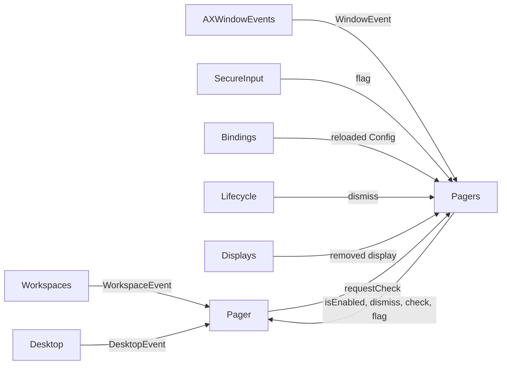
```mermaid
flowchart LR
    Workspaces -->|WorkspaceEvent| Pager
    Desktop -->|DesktopEvent| Pager
    AXWindowEvents -->|WindowEvent| Pagers
    SecureInput -->|flag| Pagers
    Bindings -->|reloaded Config| Pagers
    Lifecycle -->|dismiss| Pagers
    Displays -->|removed display| Pagers
    Pager -->|requestCheck| Pagers
    Pagers -->|"isEnabled, dismiss, check, flag"| Pager
```

`Pagers` holds one `Pager` per display and watches the window events, the secure input flag and hidden applications once for all of them. Each check reads the window list once. A `Pager` sits in the bottom right corner of its display, and every screen corner gets a mask. The pager draws with Core Animation: SwiftUI used substantially more CPU on Intel Macs.

### Component index

| Component                     | Category  | Description                                                                                                                    |
|-------------------------------|-----------|--------------------------------------------------------------------------------------------------------------------------------|
| `ConfigFile`                  | Input     | Reads the user's config file, or the bundled one.                                                                              |
| `Config`                      | Input     | The `KeyCombo → Binding` table, indexed by key code, the pager and the spacing.                                                |
| `Bindings`                    | Input     | The bindings currently up: `start`, `stop`, `reload`.                                                                          |
| `Hotkeys`                     | Input     | A session `CGEventTap` on keyDown, running on a thread of its own.                                                             |
| `SecureInput`                 | Input     | The window server flag that withholds keystrokes from every tap: its value and changes.                                        |
| `Displays`                    | Engine    | One engine per connected display. Routes each binding and window event to one engine, and moves a window that changed display. |
| `Engine`                      | Engine    | Runs each window event and action as one operation over the five parts below.                                                  |
| `Admission`                   | Engine    | Whether a window can be taken now, may be worth reading again, or never qualifies.                                             |
| `WindowPlacement`             | Engine    | Keeps a window's workspace membership and its desktop placement in step.                                                       |
| `WindowEnrollment`            | Engine    | Enrolls a window announced before it was on screen, retrying the read for a moment.                                            |
| `Navigation`                  | Engine    | Restores the focus after a change, and follows the user to the workspace they focused.                                         |
| `FullScreenReturns`           | Engine    | Notices a window back from full screen on every event, and polls after a Space change.                                         |
| `Desktop`                     | Engine    | The protocol the engine moves, parks and focuses windows on one display through.                                               |
| `WindowSystem`                | Engine    | The focused window, the on-screen window frames, and the tab count of a window. A scoped copy sees one display.                |
| `Window`                      | Engine    | The window operations the desktop needs: snapshot, frames, moves, focus, tabs.                                                 |
| `Workspaces`                  | Model     | Window → workspace, focus history, current workspace.                                                                          |
| `Workspace`                   | Model     | The windows of one workspace and the order they were focused in.                                                               |
| `TabGroups`                   | Model     | Infers which windows are tabs of one another. Reads tab counts and frames on demand.                                           |
| `Neighbors`                   | Model     | The windows around one frame, and which of them a focus move lands on.                                                         |
| `Step`                        | Model     | One move of a window by the spacing, kept within the screen.                                                                   |
| `Resize`                      | Model     | One resize of a window by the spacing from its top left corner, kept within the screen.                                        |
| `Half`                        | Model     | One side of a rect, taking half of it, with the gap kept between the two halves.                                               |
| `WorkArea`                    | Model     | Where a frame change sends a window on a display, and the outcome to record.                                                   |
| `FrameChange`                 | Model     | What a frame is asked to become: move, resize, center, maximize, tile, park or unpark.                                         |
| `HiddenEdge`                  | Model     | Where a parked window sits on a display, and whether a frame sits there.                                                       |
| `ParkedWindows`               | Model     | The windows parked at the hidden edge, and the frame each one was parked from.                                                 |
| `OriginalFrames`              | Model     | The frame each maximized or filled window restores to, shared by its tabs.                                                     |
| `Arrangement`                 | Model     | The connected displays, the primary first, and the display a frame is on.                                                      |
| `DisplayLayouts`              | Model     | The last frame each window had on each display, kept after the display disconnects.                                            |
| `Fit`                         | Model     | One frame moved between two visible frames, each axis keeping its share of the room.                                           |
| `SavedState`                  | Model     | What the state file holds for one display, less the windows no longer open.                                                    |
| `ParkingDesktop`              | macOS     | The `Desktop` that parks windows at the hidden edge of one display and reports `DesktopEvent`s.                                |
| `SpaceAnchor`                 | macOS     | A clear 1x1 window on the managed Space of one display. Focusing it switches macOS to that Space.                              |
| `Screens`                     | Engine    | The connected displays, the active display, and the screen parameters notification. `.system` reads `NSScreen`.                |
| `RunningApplicationsObserver` | macOS     | The `NSWorkspace` notifications of the applications' lifecycle, and what to announce.                                          |
| `ApplicationFilter`           | macOS     | Which applications are worth an AX subscription: not OttoWM, the lock screen or WebKit.                                        |
| `WindowEvents`                | macOS     | The window events and the scans the observer reads: start, discover, inventory, stop.                                          |
| `AXWindowEvents`              | macOS     | The AX notifications of the watched applications, as `WindowEvent`s.                                                           |
| `Applications`                | macOS     | The applications watched, and the window each `CGWindowID` belongs to.                                                         |
| `Application`                 | macOS     | One watched application: its channel and subscription, the windows it reads, their ids.                                        |
| `Subscription`                | macOS     | The AX notifications one element is subscribed to, and whether the attempt succeeded.                                          |
| `AXNotifications`             | macOS     | The AX notification channel of one process: subscribe an element, invalidate the lot.                                          |
| `AXWindow`                    | macOS     | One window: snapshot, frame writes, focus, tab count, read through `AXAccess`.                                                 |
| `AXAccess`                    | macOS     | The raw AX calls: reads, writes, actions, window id, activation, frontmost application.                                        |
| `OperationCache`              | macOS     | Holds one AX or CG read for the length of an operation.                                                                        |
| `RoundTrips`                  | macOS     | Prices an operation in the calls it makes out of the process: how many, of what, cost.                                         |
| `Signposts`                   | macOS     | The operation and round-trip intervals Instruments records.                                                                    |
| `XDGDirectory`                | macOS     | The directory an XDG variable names, where the config and state files live.                                                    |
| `Requirements`                | macOS     | The macOS settings the README lists, read from their `defaults` domains.                                                       |
| `AppDelegate`                 | Lifecycle | The startup order.                                                                                                             |
| `ConfigGate`                  | Lifecycle | The config startup gate: the error alert, and whether to relaunch or quit.                                                     |
| `StateFile`                   | Lifecycle | Reads and writes the state file, ignoring one saved in another login session.                                                  |
| `AccessibilityPermission`     | Lifecycle | The startup gate, and the watch on the accessibility trust.                                                                    |
| `ScreenLock`                  | Lifecycle | Reports whether the login window covers the session, and when it is uncovered.                                                 |
| `Lifecycle`                   | Lifecycle | The transitions once it owns windows: `quit`, SIGTERM, relaunch, reload, unlock.                                               |
| `AccessibilityAlert`          | UI        | The accessibility permission alerts: what they say and how they show.                                                          |
| `ConfigAlert`                 | UI        | The config error alert UI.                                                                                                     |
| `Pagers`                      | UI        | The Pager of each display: the pager setting, the dismiss at quit, one window list read per check.                             |
| `Pager`                       | UI        | The workspace tab over the parked windows of one display, the cue under it, and the corner masks.                              |
| `Status`                      | UI        | The About window: reads the report while it is up, runs its buttons.                                                           |
| `StatusWindow`                | UI        | The About panel UI: identity, status grid, buttons and links.                                                                  |

## Flows

### Startup

`AppDelegate` passes two gates before it reads any window: `ConfigGate.load()` and `AccessibilityPermission.request()` each return, quit, or relaunch once the user fixed the cause.

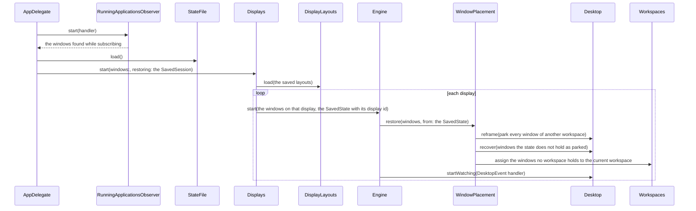
```mermaid
sequenceDiagram
    AppDelegate->>RunningApplicationsObserver: start(handler)
    RunningApplicationsObserver-->>AppDelegate: the windows found while subscribing
    AppDelegate->>StateFile: load()
    AppDelegate->>Displays: start(windows:, restoring: the SavedSession)
    Displays->>DisplayLayouts: load(the saved layouts)
    loop each display
        Displays->>Engine: start(the windows on that display, the SavedState with its display id)
        Engine->>WindowPlacement: restore(windows, from: the SavedState)
        WindowPlacement->>Desktop: reframe(park every window of another workspace)
        WindowPlacement->>Desktop: recover(windows the state does not hold as parked)
        WindowPlacement->>Workspaces: assign the windows no workspace holds to the current workspace
        Engine->>Desktop: startWatching(DesktopEvent handler)
    end
```

Then `AppDelegate` saves the state every 10 seconds, applies the pager setting, starts the bindings, and watches SIGTERM, the screen lock and the accessibility trust.

### State file

`$XDG_STATE_HOME/ottowm/state.json` (`~/.local/state/ottowm/state.json` by default) holds one `SavedSession`: a `SavedState` per display (workspaces, parked windows, original frames) and the `DisplayLayouts` shared by every engine. `Displays` writes it when the session changed: every 10 seconds, since a crash runs no quit handler, on quit once the parked windows are back on screen, and after a removed display is absorbed.

Window ids are only reliable within one login session, so a file from another session is ignored, as is one that does not decode. At launch each engine loads the section with its display id, less the windows that are gone or that admission refuses, and the layouts of windows that are gone are dropped. A section whose display is not connected is dropped at the next write, and its windows join the current workspace of the display they are on. A window saved as parked stays at the hidden edge.

### Routing

`Displays` runs a binding or a routed event in one operation, so the engine's reads return the values `Displays` read.

| Input                                | Goes to                                                                                                                       |
|--------------------------------------|-------------------------------------------------------------------------------------------------------------------------------|
| Binding                              | The engine of the active display, after a reconcile.                                                                          |
| `created`, `unminimized`, `focused`  | The engine holding the window, parked or full screen, else the engine of the display that holds the frame, after a reconcile. |
| `destroyed`, `minimized`, `reframed` | The engine holding the window. A `destroyed` window no engine holds leaves `DisplayLayouts`.                                  |
| `start`, `resync` windows            | Grouped by the rule of `focused`.                                                                                             |

The diagrams below start at the engine the input was routed to.

### Workspace switch

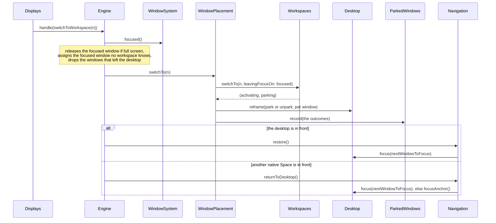
```mermaid
sequenceDiagram
    Displays->>Engine: handle(switchToWorkspace(n))
    Engine->>WindowSystem: focused()
    Note over Engine: releases the focused window if full screen,<br/>assigns the focused window no workspace knows,<br/>drops the windows that left the desktop
    Engine->>WindowPlacement: switchTo(n)
    WindowPlacement->>Workspaces: switchTo(n, leavingFocusOn: focused)
    Workspaces-->>WindowPlacement: (activating, parking)
    WindowPlacement->>Desktop: reframe(park or unpark, per window)
    WindowPlacement->>ParkedWindows: record(the outcomes)
    alt the desktop is in front
        Engine->>Navigation: restore()
        Navigation->>Desktop: focus(nextWindowToFocus)
    else another native Space is in front
        Engine->>Navigation: returnToDesktop()
        Navigation->>Desktop: focus(nextWindowToFocus), else focusAnchor()
    end
```

### Move window to workspace

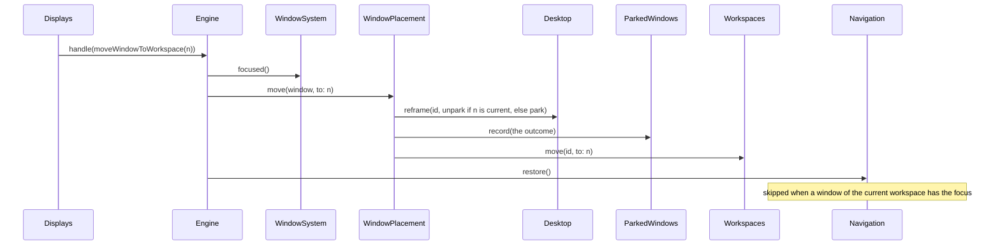
```mermaid
sequenceDiagram
    Displays->>Engine: handle(moveWindowToWorkspace(n))
    Engine->>WindowSystem: focused()
    Engine->>WindowPlacement: move(window, to: n)
    WindowPlacement->>Desktop: reframe(id, unpark if n is current, else park)
    WindowPlacement->>ParkedWindows: record(the outcome)
    WindowPlacement->>Workspaces: move(id, to: n)
    Engine->>Navigation: restore()
    Note over Navigation: skipped when a window of the current workspace has the focus
```

### Focus a neighbour window

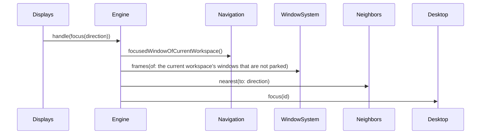
```mermaid
sequenceDiagram
    Displays->>Engine: handle(focus(direction))
    Engine->>Navigation: focusedWindowOfCurrentWorkspace()
    Engine->>WindowSystem: frames(of: the current workspace's windows that are not parked)
    Engine->>Neighbors: nearest(to: direction)
    Engine->>Desktop: focus(id)
```

### Change the frame of the focused window

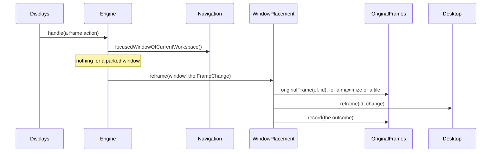
```mermaid
sequenceDiagram
    Displays->>Engine: handle(a frame action)
    Engine->>Navigation: focusedWindowOfCurrentWorkspace()
    Note over Engine: nothing for a parked window
    Engine->>WindowPlacement: reframe(window, the FrameChange)
    WindowPlacement->>OriginalFrames: originalFrame(of: id), for a maximize or a tile
    WindowPlacement->>Desktop: reframe(id, change)
    WindowPlacement->>OriginalFrames: record(the outcome)
```

### Manual navigation

The user can reach a parked window without OttoWM, through Cmd-Tab, the Dock or Mission Control.

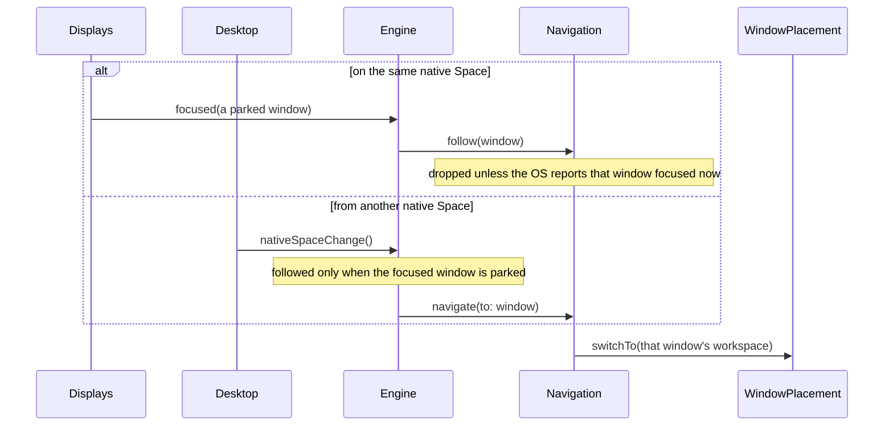
```mermaid
sequenceDiagram
    participant Displays
    participant Desktop
    participant Engine
    participant Navigation
    participant WindowPlacement

    alt on the same native Space
        Displays->>Engine: focused(a parked window)
        Engine->>Navigation: follow(window)
        Note over Navigation: dropped unless the OS reports that window focused now
    else from another native Space
        Desktop->>Engine: nativeSpaceChange()
        Note over Engine: followed only when the focused window is parked
        Engine->>Navigation: navigate(to: window)
    end
    Navigation->>WindowPlacement: switchTo(that window's workspace)
```

A Space change also pulls a parked window back on screen when its full screen instance exits.

### Display change

macOS posts the screen parameters notification when a display is added, removed or moved, and when the Dock, the menu bar or the scaling changes, often more than once per change. Behind the lock screen `Displays` ignores it and follows the screens at the unlock: the accessibility reads fail there.

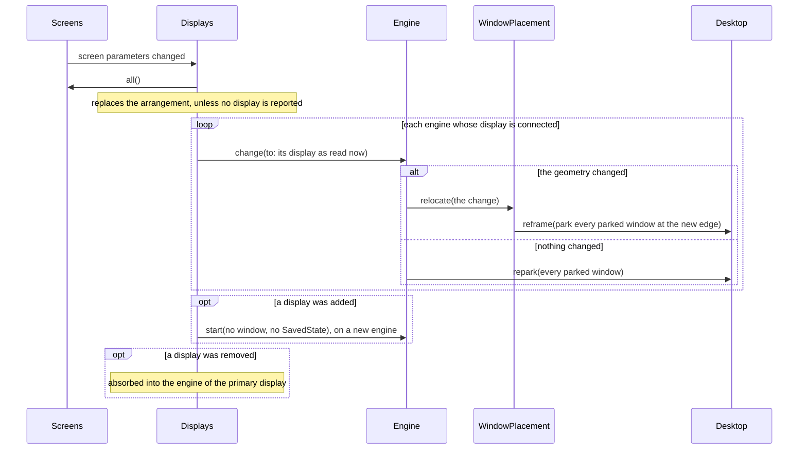
```mermaid
sequenceDiagram
    Screens->>Displays: screen parameters changed
    Displays->>Screens: all()
    Note over Displays: replaces the arrangement, unless no display is reported
    loop each engine whose display is connected
        Displays->>Engine: change(to: its display as read now)
        alt the geometry changed
            Engine->>WindowPlacement: relocate(the change)
            WindowPlacement->>Desktop: reframe(park every parked window at the new edge)
        else nothing changed
            Engine->>Desktop: repark(every parked window)
        end
    end
    opt a display was added
        Displays->>Engine: start(no window, no SavedState), on a new engine
    end
    opt a display was removed
        Note over Displays: absorbed into the engine of the primary display
    end
```

An engine keeps its display id, so only its parked windows move: the frame remembered for an active window may be older than where the user left it. macOS can move parked windows back on screen after the first notification, and the repark at the next one puts them back.

### Display removed

Whether macOS has moved the windows of a removed display by the time the notification arrives is not verified, so nothing is read at the change. `WindowPlacement` records in `DisplayLayouts` each frame it reads or parks from, and the absorb works from those records.

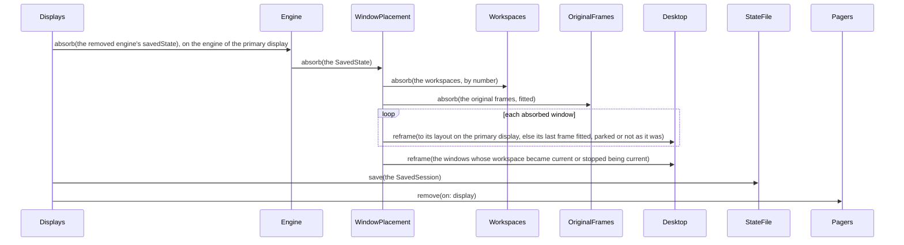
```mermaid
sequenceDiagram
    Displays->>Engine: absorb(the removed engine's savedState), on the engine of the primary display
    Engine->>WindowPlacement: absorb(the SavedState)
    WindowPlacement->>Workspaces: absorb(the workspaces, by number)
    WindowPlacement->>OriginalFrames: absorb(the original frames, fitted)
    loop each absorbed window
        WindowPlacement->>Desktop: reframe(to its layout on the primary display, else its last frame fitted, parked or not as it was)
    end
    WindowPlacement->>Desktop: reframe(the windows whose workspace became current or stopped being current)
    Displays->>StateFile: save(the SavedSession)
    Displays->>Pagers: remove(on: display)
```

The removed engine is not stopped: stopping puts its parked windows back on screen. An engine that held no window also takes the removed engine's current workspace. A window both engines held keeps its place in the absorbing engine.

### A window moved to another display

A drag reaches OttoWM only as `reframed`. With more than one display, `Displays` reconciles before each binding, each `created`, `focused` and `unminimized` event, and at the unlock.

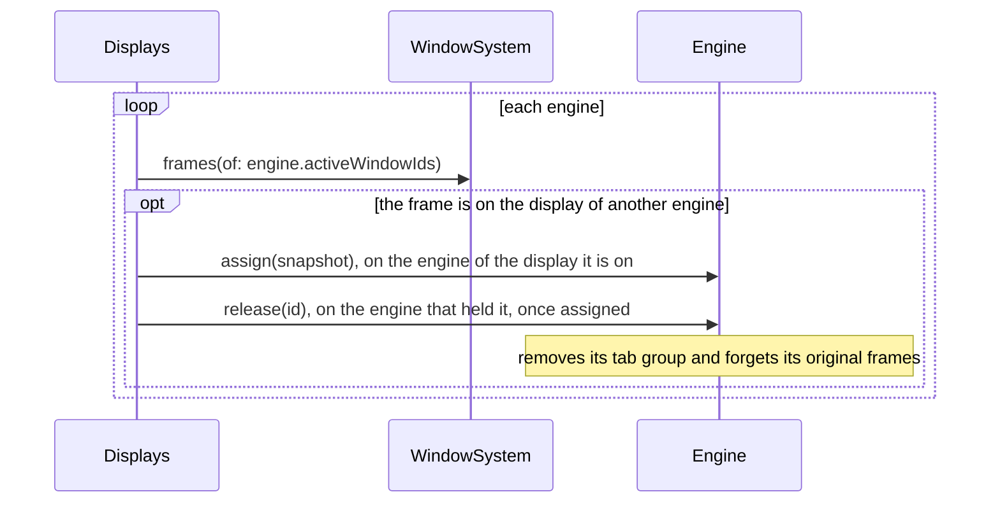
```mermaid
sequenceDiagram
    loop each engine
        Displays->>WindowSystem: frames(of: engine.activeWindowIds)
        opt the frame is on the display of another engine
            Displays->>Engine: assign(snapshot), on the engine of the display it is on
            Displays->>Engine: release(id), on the engine that held it, once assigned
            Note over Engine: removes its tab group and forgets its original frames
        end
    end
```

Parked windows are skipped: they stand at their own display's corner. A window the on-screen list does not show, or that the engine of its new display refuses, stays with the engine that holds it.

### Full screen round trip

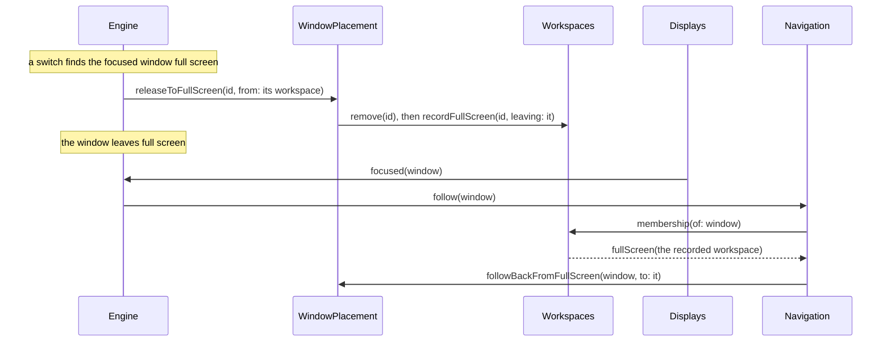
```mermaid
sequenceDiagram
    Note over Engine: a switch finds the focused window full screen
    Engine->>WindowPlacement: releaseToFullScreen(id, from: its workspace)
    WindowPlacement->>Workspaces: remove(id), then recordFullScreen(id, leaving: it)
    Note over Engine: the window leaves full screen
    Displays->>Engine: focused(window)
    Engine->>Navigation: follow(window)
    Navigation->>Workspaces: membership(of: window)
    Workspaces-->>Navigation: fullScreen(the recorded workspace)
    Navigation->>WindowPlacement: followBackFromFullScreen(window, to: it)
```

The record is taken after the removal, which clears every other trace of the window.

### Config reload

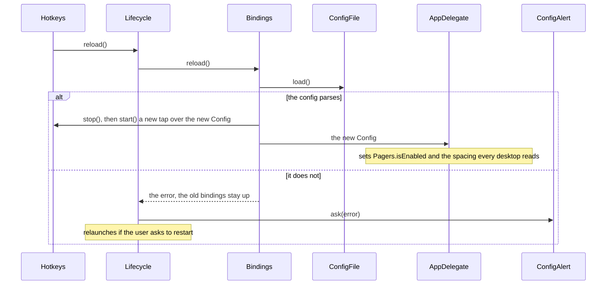
```mermaid
sequenceDiagram
    Hotkeys->>Lifecycle: reload()
    Lifecycle->>Bindings: reload()
    Bindings->>ConfigFile: load()
    alt the config parses
        Bindings->>Hotkeys: stop(), then start() a new tap over the new Config
        Bindings->>AppDelegate: the new Config
        Note over AppDelegate: sets Pagers.isEnabled and the spacing every desktop reads
    else it does not
        Bindings-->>Lifecycle: the error, the old bindings stay up
        Lifecycle->>ConfigAlert: ask(error)
        Note over Lifecycle: relaunches if the user asks to restart
    end
```

The matcher is read on the tap thread, so it is replaced with the tap rather than written under it.

### Shutdown

The ways out are a bound `quit` action and SIGTERM, which `Lifecycle` takes on a `DispatchSourceSignal` on the main queue instead of the default action. `Lifecycle.relaunch` restores the frames the same way, then exits once the new instance is up.

```mermaid
sequenceDiagram
    Lifecycle->>Displays: stop()
    loop each display
        Displays->>Engine: stop()
        Engine->>WindowPlacement: restoreParkedWindows()
    end
    Displays->>StateFile: save(the SavedSession, no window parked)
    Lifecycle->>Pagers: dismiss(then: exit)
    Note over Pagers: exits once every Pager has slid out
```

### Unlock

Window events are dropped while the screen is locked, and a sweep behind the login window reads every window as closed. At the unlock `Lifecycle` runs the removals first and the additions after.

```mermaid
sequenceDiagram
    ScreenLock->>Lifecycle: unlocked
    Lifecycle->>RunningApplicationsObserver: resync()
    RunningApplicationsObserver->>AXWindowEvents: sweepDeadWindows()
    AXWindowEvents->>Displays: destroyed(windowId), for each window that stopped answering
    RunningApplicationsObserver->>AXWindowEvents: inventory(app), or start(app), for each running application
    RunningApplicationsObserver-->>Lifecycle: every window
    Lifecycle->>Displays: resync(windows:)
    Note over Displays: follows the screen changes behind the lock, then reconciles
    Displays->>Engine: resync(its windows), on every engine
```

### Window lifecycle

```mermaid
flowchart LR
    new[new or discovered window] -->|valid| managed[in a workspace]
    managed -->|minimized, full screen, destroyed, its application terminated, or moved to another native Space| unmanaged
    unmanaged -->|unminimized, or focused again| managed
    managed -->|"moved to another display"| managed
```

## Tabbed windows

macOS reports no tab membership, so OttoWM infers it. A tab group is one window to macOS: its tabs minimize, restore and move together.

### Discovery

```mermaid
sequenceDiagram
    participant RunningApplicationsObserver
    participant Engine
    participant Navigation
    participant Workspaces
    participant TabGroups

    Note over RunningApplicationsObserver: Application.attach registers the window before the event goes on
    RunningApplicationsObserver->>Engine: focused(window), through Displays
    Engine->>Navigation: follow(window)
    Navigation->>Workspaces: assign(window), through WindowPlacement
    Workspaces->>TabGroups: add(window)
    Note over TabGroups: reads how many tabs the window shows
    Workspaces-->>Navigation: the workspace of the group it joined
    Note over Navigation: a different workspace means the user is followed there
```

An application lists only the active tab of a group, and sends no notification when the user switches tabs. A background tab is discovered when it takes the focus, through this event or through `AXWindowEvents.adoptFocusedWindow`, which `WindowSystem.focused()` reads through.

### Membership

```mermaid
flowchart LR
    win[window being assigned] --> tabs{more than one tab?}
    tabs -->|no| own["opens a new group"]
    tabs -->|yes| match{"same application, fewer members than the window has tabs,<br/>same x, y within 10 pt, width and height within 30 pt<br/>of where a group is now?"}
    match -->|yes| join[joins that group]
    match -->|no| own
```

Merging windows into tabs posts no notification, so a window seen before the merge still holds a group of its own. A window alone in its group is matched again every time it is added, one with siblings is not: it joins the group of the window it was merged into, and the group it leaves is dropped. Matching reads the tab count, so it happens when a window is focused for an action or moved, not on a workspace switch.

### Group events

| Event                                              | What OttoWM does                                                                                          |
|----------------------------------------------------|-----------------------------------------------------------------------------------------------------------|
| A tab takes the focus for the first time           | Adds it to a group, and assigns it the workspace of that group. The group does not follow the new window. |
| The group of that tab is in another workspace      | Switches to that workspace.                                                                               |
| A workspace switch, or a move to another workspace | Places every member of the group together.                                                                |
| A tab closes                                       | Drops the window. A sibling keeps the focus, so no other window is chosen.                                |
| Two windows are merged into tabs                   | Matches the window acted on again, and it joins the group of the window it was merged into.               |
| The group is minimized                             | macOS minimizes every member and names one. Drops all of them, then picks a new window to focus.          |
