# Architecture

OttoWM is a headless agent that offers several workspaces on the native macOS Space of each display.

## Vocabulary

| Concept        | Meaning                                                                                                                                                                                                              |
|----------------|----------------------------------------------------------------------------------------------------------------------------------------------------------------------------------------------------------------------|
| Native Space   | A macOS space. OttoWM uses one per display, the one in front when it starts or when the display is added. A window on another Space is ignored.                                                                      |
| Desktop        | The native Space OttoWM controls on one display, and the component that moves windows on it.                                                                                                                         |
| Workspace      | A numbered set of windows. It exists as soon as an action names it.                                                                                                                                                  |
| Managed window | A window that belongs to a workspace.                                                                                                                                                                                |
| Display        | A connected display: the CoreGraphics UUID that identifies it across plugs, its full frame and visible frame. The primary display is the first `NSScreen.screens` returns, the one at the origin of the arrangement. |
| Arrangement    | The connected displays, the primary first. A frame is on the display that holds the larger part of it, the rule macOS uses to give a window a Space. A frame on no display is on the nearest one.                    |
| Active display | The display of the focused window, else the display `NSScreen.main` returns, which has the active menu bar. Bindings act on it.                                                                                      |
| Hidden edge    | A 1pt sliver at the bottom right of each display. A window not in the current workspace of its display is parked there.                                                                                              |
| Tab group      | The windows macOS shows as tabs of one window. See [Tabbed windows](#tabbed-windows).                                                                                                                                |
| Window id      | The `CGWindowID` of a window. It identifies the window for as long as the window lives.                                                                                                                              |
| Frame          | A rect in top-left coordinates.                                                                                                                                                                                      |
| Operation      | One unit of engine work. The focused window and the list of on-screen window ids are read at most once in it.                                                                                                        |

## Level 1: System context


```mermaid
flowchart LR
    user([User])
    otto["OttoWM"]
    macos["macOS"]

    user -->|key combos| otto
    user -->|Cmd-Tab, Dock, Mission Control| macos
    otto -->|moves and focuses windows| macos
    macos -->|window events| otto
```

## Level 2: Containers

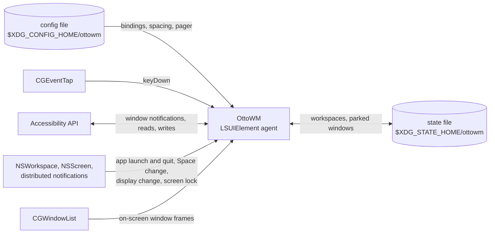
```mermaid
flowchart LR
    config[("config file<br/>$XDG_CONFIG_HOME/ottowm")]
    state[("state file<br/>$XDG_STATE_HOME/ottowm")]
    otto["OttoWM<br/>LSUIElement agent"]
    ax["Accessibility API"]
    tap["CGEventTap"]
    ws["NSWorkspace, NSScreen,<br/>distributed notifications"]
    cg["CGWindowList"]

    config -->|bindings, spacing, pager| otto
    otto <-->|workspaces, parked windows| state
    tap -->|keyDown| otto
    ax <-->|window notifications, reads, writes| otto
    ws -->|app launch and quit, Space change,<br/>display change, screen lock| otto
    cg -->|on-screen window frames| otto
```

## Level 3: Components

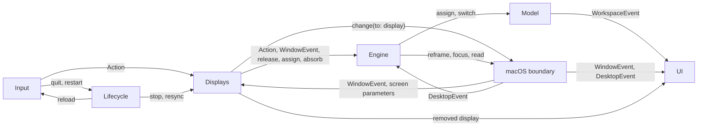
```mermaid
flowchart LR
    Input -->|Action| Displays
    Input -->|quit, restart| Lifecycle
    Lifecycle -->|reload| Input
    Lifecycle -->|stop, resync| Displays
    macOS["macOS boundary"] -->|WindowEvent, screen parameters| Displays
    Displays -->|"Action, WindowEvent, release, assign, absorb"| Engine
    Displays -->|"change(to: display)"| macOS
    macOS -->|DesktopEvent| Engine
    Engine -->|reframe, focus, read| macOS
    Engine -->|assign, switch| Model
    Model -->|WorkspaceEvent| UI
    macOS -->|WindowEvent, DesktopEvent| UI
    Displays -->|removed display| UI
```

`Displays` holds one `Engine` per connected display.

The messages on the arrows:

```
Action         = switchToWorkspace(n) | moveWindowToWorkspace(n) | focus(direction) | moveWindow(direction)
               | resize(change) | centerWindow | maximize | tile(direction)
Binding        = action(Action) | quit | restart
WindowEvent    = created(snapshot) | focused(snapshot) | destroyed(id) | minimized(id) | unminimized(snapshot)
               | reframed
DesktopEvent   = nativeSpaceChange | displayChange(from: Display, to: Display) | screenParametersChange
WorkspaceEvent = switched(n)
```

`AppDelegate` builds every component and wires them with closures. The diagrams below show the calls made after startup.

### Input

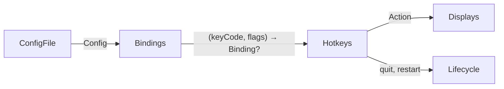
```mermaid
flowchart LR
    ConfigFile -->|Config| Bindings
    Bindings -->|"(keyCode, flags) → Binding?"| Hotkeys
    Hotkeys -->|Action| Displays
    Hotkeys -->|quit, restart| Lifecycle
```

The tap thread matches the key and dispatches the action to the main queue. Accessibility writes are only allowed on the main queue.

### Displays

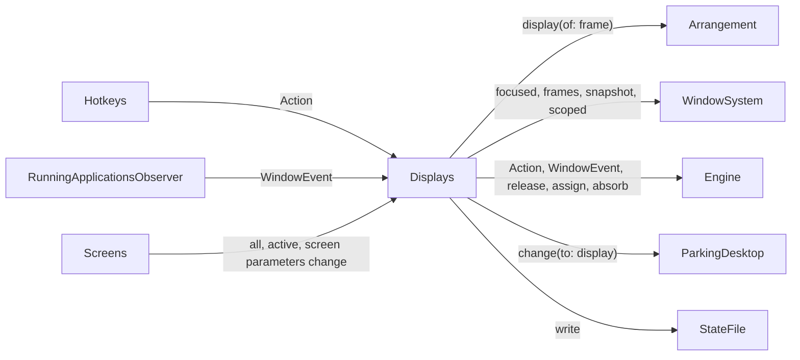
```mermaid
flowchart LR
    Hotkeys -->|Action| Displays
    RunningApplicationsObserver -->|WindowEvent| Displays
    Screens -->|"all, active, screen parameters change"| Displays
    Displays -->|"display(of: frame)"| Arrangement
    Displays -->|"focused, frames, snapshot, scoped"| WindowSystem
    Displays -->|"Action, WindowEvent, release, assign, absorb"| Engine
    Displays -->|"change(to: display)"| ParkingDesktop
    Displays -->|write| StateFile
```

`AppDelegate` hands `Displays` a closure that builds the `ParkingDesktop`, `Workspaces`, `Engine` and `Pager` of one display. `Displays` calls it for each display connected at launch, the primary first, and for each display added later. Each engine gets a `WindowSystem` scoped to its display: `focused()`, `shows`, `showsAny` and `frames(of:)` leave out the windows whose larger part is on another display. `snapshot(of:)`, `frame(of:)` and `tabCount(of:)` read one known window and are not scoped. The scoped copies share the caches, so one operation reads the focused window and the on-screen list once.

Per display: the engine and the parts `Engine.system` builds, `Workspaces`, `ParkedWindows`, `OriginalFrames`, `ParkingDesktop`, `SpaceAnchor` and `Pager`. Shared: `DisplayLayouts`, the `WindowSystem` caches, `Bindings`, `Hotkeys`, `RunningApplicationsObserver`, `AXWindowEvents`, `Applications` and `StateFile`.

### Engine and model

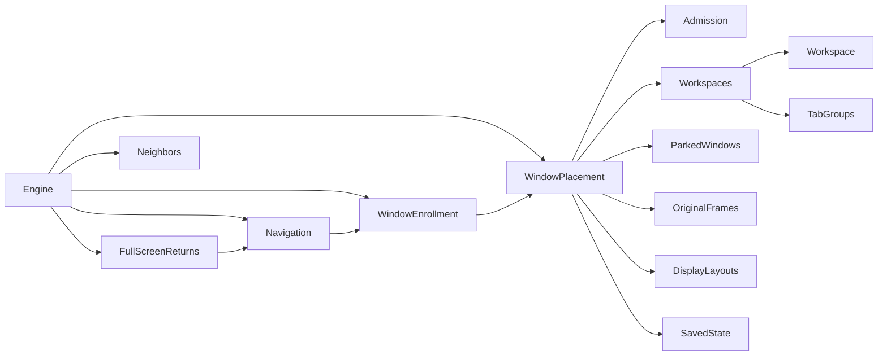
```mermaid
flowchart LR
    Engine --> Navigation & FullScreenReturns & WindowEnrollment & WindowPlacement
    Engine --> Neighbors
    FullScreenReturns --> Navigation
    Navigation --> WindowEnrollment --> WindowPlacement
    WindowPlacement --> Admission
    WindowPlacement --> Workspaces & ParkedWindows & OriginalFrames & DisplayLayouts & SavedState
    Workspaces --> Workspace & TabGroups
```

Every engine component reads the focused window and snapshots through `WindowSystem`, and reads membership from `Workspaces`. `TabGroups` reads tab counts and frames through `WindowSystem` when a window is assigned.

### macOS boundary

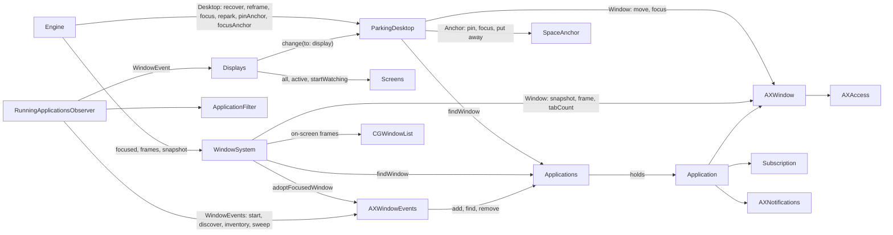
```mermaid
flowchart LR
    Engine -->|"Desktop: recover, reframe, focus, repark, pinAnchor, focusAnchor"| ParkingDesktop
    Engine -->|focused, frames, snapshot| WindowSystem
    RunningApplicationsObserver -->|WindowEvent| Displays
    Displays -->|"change(to: display)"| ParkingDesktop
    Displays -->|"all, active, startWatching"| Screens

    ParkingDesktop -->|findWindow| Applications
    ParkingDesktop -->|"Window: move, focus"| AXWindow
    ParkingDesktop -->|"Anchor: pin, focus, put away"| SpaceAnchor

    WindowSystem -->|adoptFocusedWindow| AXWindowEvents
    WindowSystem -->|on-screen frames| CGWindowList
    WindowSystem -->|findWindow| Applications
    WindowSystem -->|"Window: snapshot, frame, tabCount"| AXWindow

    RunningApplicationsObserver --> ApplicationFilter
    RunningApplicationsObserver -->|"WindowEvents: start, discover, inventory, sweep"| AXWindowEvents
    AXWindowEvents -->|add, find, remove| Applications
    Applications -->|holds| Application
    Application --> Subscription & AXNotifications & AXWindow
    AXWindow --> AXAccess
```

`Desktop`, `WindowSystem` and `Window` belong to the engine. `AppDelegate` hands `ParkingDesktop` and `WindowSystem` `Applications.findWindow` as a closure, so neither depends on `Applications`. `ParkingDesktop` computes target frames on its display with `WorkArea` and `HiddenEdge`, which read no system state. It reads no screen: `Displays` hands it its display. `Screens.system` reads `NSScreen` and observes the screen parameters notification.

`AXWindowEvents` pushes the AX notifications and the sweep. A scan (`start`, `discover`, `inventory`) returns what it found, and `RunningApplicationsObserver` decides what to announce.

### Lifecycle

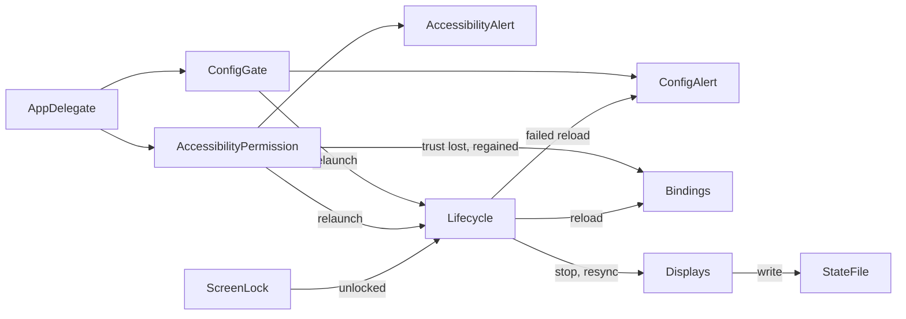
```mermaid
flowchart LR
    AppDelegate --> ConfigGate --> ConfigAlert
    AppDelegate --> AccessibilityPermission --> AccessibilityAlert
    AccessibilityPermission -->|trust lost, regained| Bindings
    ConfigGate & AccessibilityPermission -->|relaunch| Lifecycle
    ScreenLock -->|unlocked| Lifecycle
    Lifecycle -->|stop, resync| Displays
    Lifecycle -->|reload| Bindings
    Lifecycle -->|failed reload| ConfigAlert
    Displays -->|write| StateFile
```

While `Lifecycle.screenIsLocked` is set, `Engine` drops window events, `Displays` defers every screen change, and `AXWindowEvents` skips the sweep.

### UI

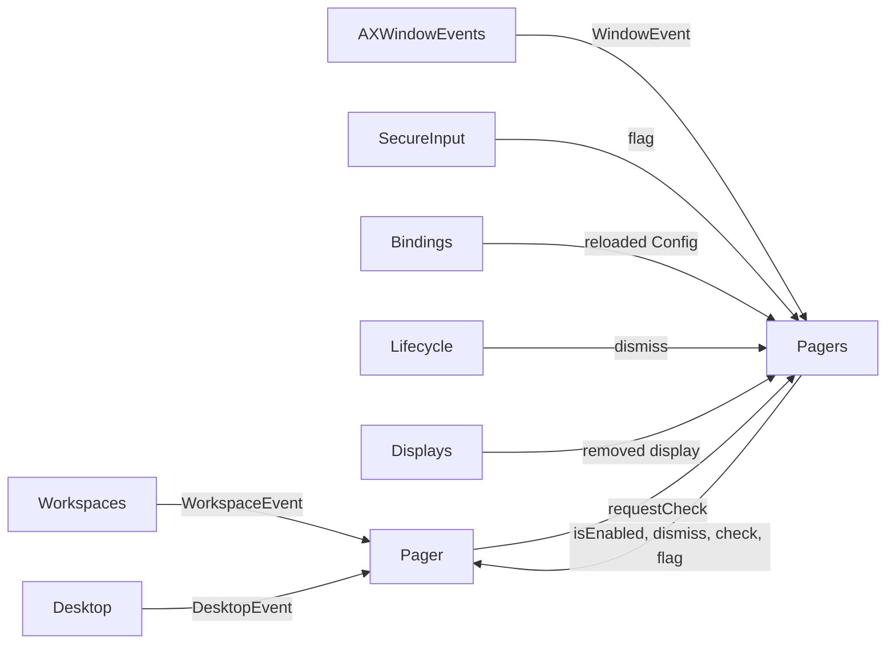
```mermaid
flowchart LR
    Workspaces -->|WorkspaceEvent| Pager
    Desktop -->|DesktopEvent| Pager
    AXWindowEvents -->|WindowEvent| Pagers
    SecureInput -->|flag| Pagers
    Bindings -->|reloaded Config| Pagers
    Lifecycle -->|dismiss| Pagers
    Displays -->|removed display| Pagers
    Pager -->|requestCheck| Pagers
    Pagers -->|"isEnabled, dismiss, check, flag"| Pager
```

Each display has its own `Pager`, built from that display's `Workspaces` and `Desktop`. `Pagers` holds them by display. It watches the window events, the secure input flag and hidden applications once for every Pager, and each check reads the window list once.

### Component index

| Component                     | Category  | Description                                                                                                                        |
|-------------------------------|-----------|------------------------------------------------------------------------------------------------------------------------------------|
| `ConfigFile`                  | Input     | Reads the user's config file, or the bundled one.                                                                                  |
| `Config`                      | Input     | The `KeyCombo → Binding` table, indexed by key code, the pager and the spacing.                                                    |
| `Bindings`                    | Input     | The bindings currently up: `start`, `stop`, `reload`.                                                                              |
| `Hotkeys`                     | Input     | A session `CGEventTap` on keyDown, running on a thread of its own.                                                                 |
| `SecureInput`                 | Input     | The window server flag that withholds keystrokes from every tap: its value and changes.                                            |
| `Displays`                    | Engine    | One engine per connected display. Routes each binding and window event to one engine, and moves a window that changed display.     |
| `Engine`                      | Engine    | Runs each window event and action as one operation over the five parts below.                                                      |
| `Admission`                   | Engine    | Whether a window can be taken now, may be worth reading again, or never qualifies.                                                 |
| `WindowPlacement`             | Engine    | Keeps a window's workspace membership and its desktop placement in step.                                                           |
| `WindowEnrollment`            | Engine    | Enrolls a window announced before it was on screen, retrying the read for a moment.                                                |
| `Navigation`                  | Engine    | Restores the focus after a change, and follows the user to the workspace they focused.                                             |
| `FullScreenReturns`           | Engine    | Notices a window back from full screen on every event, and polls after a Space change.                                             |
| `Workspaces`                  | Model     | Window → workspace, focus history, current workspace.                                                                              |
| `Workspace`                   | Model     | The windows of one workspace and the order they were focused in.                                                                   |
| `TabGroups`                   | Model     | Infers which windows are tabs of one another. Reads tab counts and frames on demand.                                               |
| `Neighbors`                   | Model     | The windows around one frame, and which of them a focus move lands on.                                                             |
| `Step`                        | Model     | One move of a window by the spacing, and where it lands within the screen.                                                         |
| `Resize`                      | Model     | One resize of a window by the spacing from its top left corner, kept within the screen.                                            |
| `Half`                        | Model     | One side of a rect, taking half of it, with the gap kept between the two halves.                                                   |
| `WorkArea`                    | Model     | Where a frame change sends a window on a display, and the outcome to record.                                                       |
| `FrameChange`                 | Model     | What a frame is asked to become: move, resize, center, maximize, tile, park or unpark.                                             |
| `ParkedWindows`               | Model     | The windows parked at the hidden edge, and the frame each one was parked from.                                                     |
| `OriginalFrames`              | Model     | The frame each maximized or filled window restores to, shared by its tabs.                                                         |
| `Arrangement`                 | Model     | The connected displays, the primary first, and the display a frame is on.                                                          |
| `DisplayLayouts`              | Model     | The last frame each window had on each display, kept after the display disconnects. Every engine shares one.                       |
| `Fit`                         | Model     | One frame moved between two visible frames, each axis keeping its share of the room.                                               |
| `SavedState`                  | Model     | What the state file holds for one display, less the windows no longer open.                                                        |
| `Desktop`                     | Engine    | The protocol the engine moves, parks and focuses windows on one display through.                                                   |
| `ParkingDesktop`              | macOS     | The `Desktop` that parks windows at the hidden edge of one display and reports `DesktopEvent`s.                                    |
| `SpaceAnchor`                 | macOS     | A clear 1x1 window on the managed Space of one display. Focusing it switches macOS to that Space.                                  |
| `HiddenEdge`                  | Model     | Where a parked window sits on a display, and whether a frame sits there.                                                           |
| `WindowSystem`                | Engine    | The focused window, the on-screen window frames, and the tab count of a window. A scoped copy sees one display.                    |
| `RunningApplicationsObserver` | macOS     | The `NSWorkspace` notifications of the applications' lifecycle, and what to announce.                                              |
| `ApplicationFilter`           | macOS     | Which applications are worth an AX subscription: not OttoWM, the lock screen or WebKit.                                            |
| `WindowEvents`                | macOS     | The window events and the scans the observer reads: start, discover, inventory, stop.                                              |
| `AXWindowEvents`              | macOS     | The AX notifications of the watched applications, as `WindowEvent`s.                                                               |
| `Applications`                | macOS     | The applications watched, and the window each `CGWindowID` belongs to.                                                             |
| `Application`                 | macOS     | One watched application: its channel and subscription, the windows it reads, their ids.                                            |
| `Subscription`                | macOS     | The AX notifications one element is subscribed to, and whether the attempt succeeded.                                              |
| `AXNotifications`             | macOS     | The AX notification channel of one process: subscribe an element, invalidate the lot.                                              |
| `Window`                      | Engine    | The window operations the desktop needs: snapshot, frames, moves, focus, tabs.                                                     |
| `AXWindow`                    | macOS     | One window: snapshot, frame writes, focus, tab count, read through `AXAccess`.                                                     |
| `AXAccess`                    | macOS     | The raw AX calls: reads, writes, actions, window id, activation, frontmost application.                                            |
| `Screens`                     | macOS     | The connected displays, the primary first, the active display, and the screen parameters notification. `.system` reads `NSScreen`. |
| `OperationCache`              | macOS     | Holds one AX or CG read for the length of an operation.                                                                            |
| `RoundTrips`                  | macOS     | Prices an operation in the calls it makes out of the process: how many, of what, cost.                                             |
| `Signposts`                   | macOS     | The operation and round-trip intervals Instruments records.                                                                        |
| `XDGDirectory`                | macOS     | The directory an XDG variable names, where the config and state files live.                                                        |
| `Requirements`                | macOS     | The macOS settings the README lists, read from their `defaults` domains.                                                           |
| `AppDelegate`                 | Lifecycle | The startup order.                                                                                                                 |
| `ConfigGate`                  | Lifecycle | The config startup gate: the error alert, and whether to relaunch or quit.                                                         |
| `StateFile`                   | Lifecycle | Reads and writes the state file, ignoring one saved in another login session.                                                      |
| `AccessibilityPermission`     | Lifecycle | The startup gate, and the watch on the accessibility trust.                                                                        |
| `ScreenLock`                  | Lifecycle | Reports whether the login window covers the session, and when it is uncovered.                                                     |
| `Lifecycle`                   | Lifecycle | The transitions once it owns windows: `quit`, SIGTERM, relaunch, reload, unlock.                                                   |
| `AccessibilityAlert`          | UI        | The accessibility permission alerts: what they say and how they show.                                                              |
| `ConfigAlert`                 | UI        | The config error alert UI.                                                                                                         |
| `Pagers`                      | UI        | The Pager of each display: the pager setting, the dismiss at quit, one window list read per check.                                 |
| `Pager`                       | UI        | The workspace tab over the parked windows of one display, the cue under it, and the corner masks.                                  |
| `Status`                      | UI        | The About window: reads the report while it is up, runs its buttons.                                                               |
| `StatusWindow`                | UI        | The About panel UI: identity, status grid, buttons and links.                                                                      |

The pager draws with Core Animation. SwiftUI used substantially more CPU on Intel Macs.

## Flows

### Startup

`AppDelegate` passes two gates before it reads any window. `ConfigGate.load()` returns the `Config`, quits, or relaunches once the user fixed the file. `AccessibilityPermission.request()` returns granted, quits, or relaunches after the grant.

It then builds `Displays`, which builds the parts of each connected display, and restores the windows:

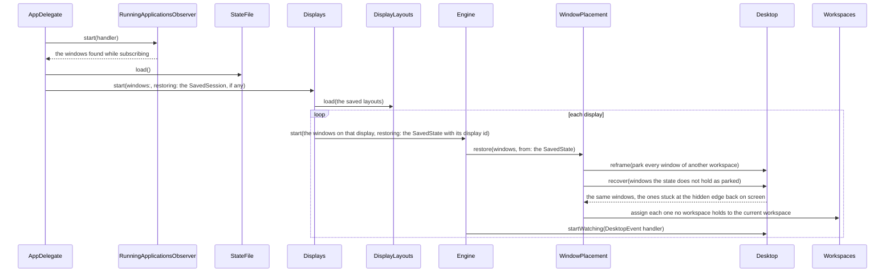
```mermaid
sequenceDiagram
    AppDelegate->>RunningApplicationsObserver: start(handler)
    RunningApplicationsObserver-->>AppDelegate: the windows found while subscribing
    AppDelegate->>StateFile: load()
    AppDelegate->>Displays: start(windows:, restoring: the SavedSession, if any)
    Displays->>DisplayLayouts: load(the saved layouts)
    loop each display
        Displays->>Engine: start(the windows on that display, restoring: the SavedState with its display id)
        Engine->>WindowPlacement: restore(windows, from: the SavedState)
        WindowPlacement->>Desktop: reframe(park every window of another workspace)
        WindowPlacement->>Desktop: recover(windows the state does not hold as parked)
        Desktop-->>WindowPlacement: the same windows, the ones stuck at the hidden edge back on screen
        WindowPlacement->>Workspaces: assign each one no workspace holds to the current workspace
        Engine->>Desktop: startWatching(DesktopEvent handler)
    end
```

Last, `AppDelegate` saves the state every 10 seconds, enables the pagers if the config asks for it, starts the bindings, and watches SIGTERM, the screen lock and the accessibility trust.

### State file

The state lives in `$XDG_STATE_HOME/ottowm/state.json`, `~/.local/state/ottowm/state.json` by default. It holds one `SavedSession`: a `SavedState` per display with the display, its workspaces, parked windows and original frames, and beside them the display layouts every engine shares, stored once. `Displays` builds the session from every engine and writes the file once per save, only when the session changed: every 10 seconds, because a crash runs no quit handler, on quit once the parked windows are back on screen, and after a removed display is absorbed. At launch `Displays` loads the layouts once, before any engine starts.

It only covers the current login session. Window ids are only reliable within one login session, so the file records the session it was written in and a file from another session is ignored. Within the session a saved window is found again by its id, and the ids of windows that are gone or that admission refuses are left out. A file that does not decode is ignored too. Either way OttoWM starts as if there were none.

A window saved as parked stays at the hidden edge, and `repark` puts it back there if macOS moved it. At launch each engine loads the section with its display id. A section whose display is not connected is not loaded, and the next write leaves it out: its windows join the current workspace of the display they are on. Full screen windows are not saved, since admission refuses them at launch.

### Routing

`Displays` hands each binding to the engine of the active display. A binding and a routed event run in one operation, `route-action` or `route-event`, so the engine's reads of the focused window and the on-screen list return the values `Displays` read.

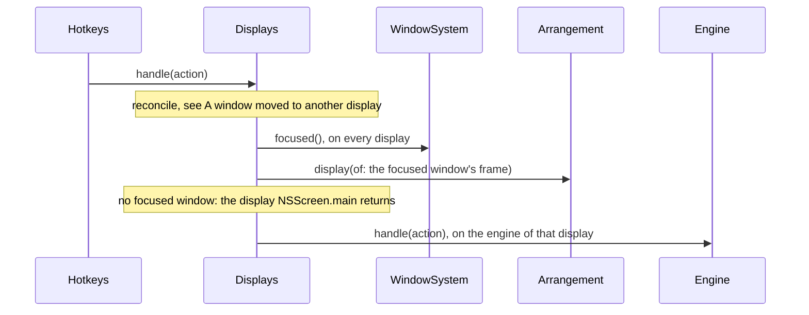
```mermaid
sequenceDiagram
    Hotkeys->>Displays: handle(action)
    Note over Displays: reconcile, see A window moved to another display
    Displays->>WindowSystem: focused(), on every display
    Displays->>Arrangement: display(of: the focused window's frame)
    Note over Displays: no focused window: the display NSScreen.main returns
    Displays->>Engine: handle(action), on the engine of that display
```

| Input                                | Goes to                                                                                                                                                                                          |
|--------------------------------------|--------------------------------------------------------------------------------------------------------------------------------------------------------------------------------------------------|
| `created`, `unminimized`, `focused`  | The engine whose workspaces hold the window, parked or full screen, else the engine of the display that holds the frame, after a reconcile. No engine holds a `created` or `unminimized` window. |
| `destroyed`, `minimized`, `reframed` | The engine whose workspaces hold the window. With no such engine, none.                                                                                                                          |
| `start`, `resync` windows            | Grouped by the rule of `focused`. At start no engine holds a window, so each goes to the engine of the display that holds its frame.                                                             |

The diagrams below start at the engine the action or event was routed to.

### Workspace switch

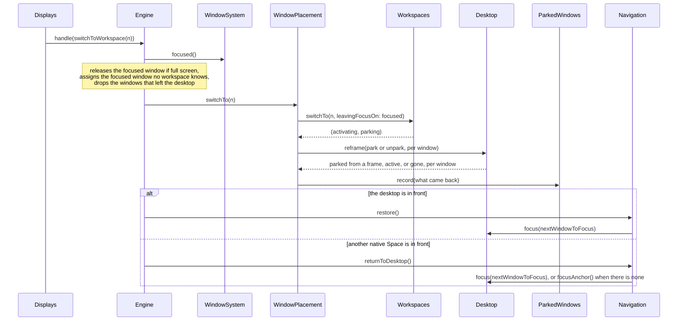
```mermaid
sequenceDiagram
    Displays->>Engine: handle(switchToWorkspace(n))
    Engine->>WindowSystem: focused()
    Note over Engine: releases the focused window if full screen,<br/>assigns the focused window no workspace knows,<br/>drops the windows that left the desktop
    Engine->>WindowPlacement: switchTo(n)
    WindowPlacement->>Workspaces: switchTo(n, leavingFocusOn: focused)
    Workspaces-->>WindowPlacement: (activating, parking)
    WindowPlacement->>Desktop: reframe(park or unpark, per window)
    Desktop-->>WindowPlacement: parked from a frame, active, or gone, per window
    WindowPlacement->>ParkedWindows: record(what came back)
    alt the desktop is in front
        Engine->>Navigation: restore()
        Navigation->>Desktop: focus(nextWindowToFocus)
    else another native Space is in front
        Engine->>Navigation: returnToDesktop()
        Navigation->>Desktop: focus(nextWindowToFocus), or focusAnchor() when there is none
    end
```

### Move window to workspace

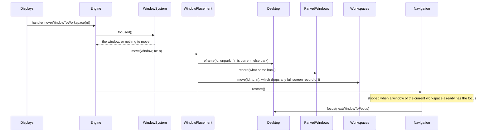
```mermaid
sequenceDiagram
    Displays->>Engine: handle(moveWindowToWorkspace(n))
    Engine->>WindowSystem: focused()
    WindowSystem-->>Engine: the window, or nothing to move
    Engine->>WindowPlacement: move(window, to: n)
    WindowPlacement->>Desktop: reframe(id, unpark if n is current, else park)
    WindowPlacement->>ParkedWindows: record(what came back)
    WindowPlacement->>Workspaces: move(id, to: n), which drops any full screen record of it
    Engine->>Navigation: restore()
    Note over Navigation: skipped when a window of the current workspace already has the focus
    Navigation->>Desktop: focus(nextWindowToFocus)
```

### Focus a neighbour window

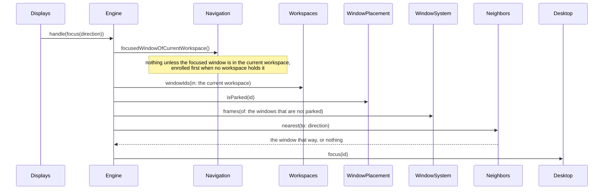
```mermaid
sequenceDiagram
    Displays->>Engine: handle(focus(direction))
    Engine->>Navigation: focusedWindowOfCurrentWorkspace()
    Note over Navigation: nothing unless the focused window is in the current workspace,<br/>enrolled first when no workspace holds it
    Engine->>Workspaces: windowIds(in: the current workspace)
    Engine->>WindowPlacement: isParked(id)
    Engine->>WindowSystem: frames(of: the windows that are not parked)
    Engine->>Neighbors: nearest(to: direction)
    Neighbors-->>Engine: the window that way, or nothing
    Engine->>Desktop: focus(id)
```

### Change the frame of the focused window

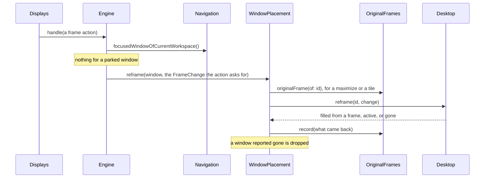
```mermaid
sequenceDiagram
    Displays->>Engine: handle(a frame action)
    Engine->>Navigation: focusedWindowOfCurrentWorkspace()
    Note over Engine: nothing for a parked window
    Engine->>WindowPlacement: reframe(window, the FrameChange the action asks for)
    WindowPlacement->>OriginalFrames: originalFrame(of: id), for a maximize or a tile
    WindowPlacement->>Desktop: reframe(id, change)
    Desktop-->>WindowPlacement: filled from a frame, active, or gone
    WindowPlacement->>OriginalFrames: record(what came back)
    Note over WindowPlacement: a window reported gone is dropped
```

### Manual navigation

The user can reach a parked window without OttoWM, through Cmd-Tab, the Dock or Mission Control.

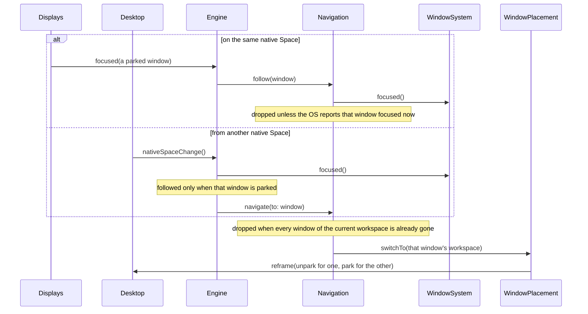
```mermaid
sequenceDiagram
    participant Displays
    participant Desktop
    participant Engine
    participant Navigation
    participant WindowSystem
    participant WindowPlacement

    alt on the same native Space
        Displays->>Engine: focused(a parked window)
        Engine->>Navigation: follow(window)
        Navigation->>WindowSystem: focused()
        Note over Navigation: dropped unless the OS reports that window focused now
    else from another native Space
        Desktop->>Engine: nativeSpaceChange()
        Engine->>WindowSystem: focused()
        Note over Engine: followed only when that window is parked
        Engine->>Navigation: navigate(to: window)
    end
    Note over Navigation: dropped when every window of the current workspace is already gone
    Navigation->>WindowPlacement: switchTo(that window's workspace)
    WindowPlacement->>Desktop: reframe(unpark for one, park for the other)
```

A Space change also pulls a parked window back on screen when its full screen instance exits.

### Display change

macOS posts the screen parameters notification when a display is added, removed or moved in the arrangement, and when the Dock, the menu bar or the scaling changes. `Displays` reads every display at each notification.

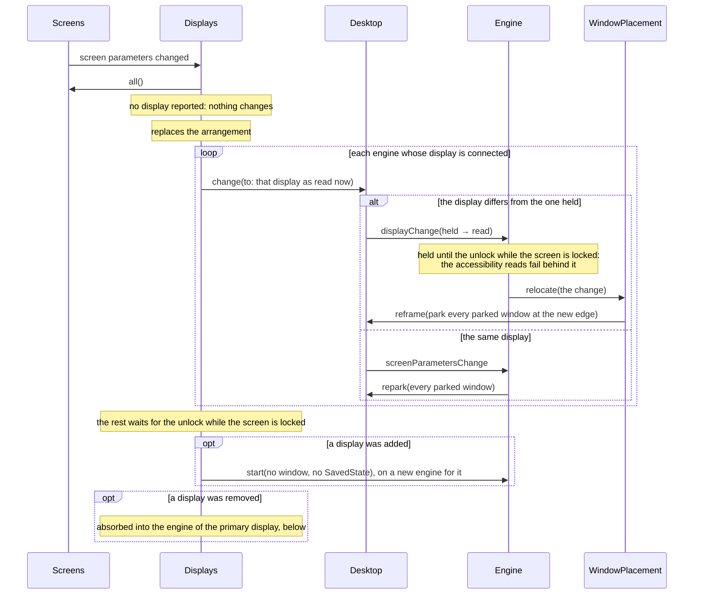
```mermaid
sequenceDiagram
    Screens->>Displays: screen parameters changed
    Displays->>Screens: all()
    Note over Displays: no display reported: nothing changes
    Note over Displays: replaces the arrangement
    loop each engine whose display is connected
        Displays->>Desktop: change(to: that display as read now)
        alt the display differs from the one held
            Desktop->>Engine: displayChange(held → read)
            Note over Engine: held until the unlock while the screen is locked:<br/>the accessibility reads fail behind it
            Engine->>WindowPlacement: relocate(the change)
            WindowPlacement->>Desktop: reframe(park every parked window at the new edge)
        else the same display
            Desktop->>Engine: screenParametersChange
            Engine->>Desktop: repark(every parked window)
        end
    end
    Note over Displays: the rest waits for the unlock while the screen is locked
    opt a display was added
        Displays->>Engine: start(no window, no SavedState), on a new engine for it
    end
    opt a display was removed
        Note over Displays: absorbed into the engine of the primary display, below
    end
```

`Displays` hands each desktop the display with the id it was built for, so a display change keeps the display: the display moved in the arrangement, or the Dock, the menu bar or the scaling changed. Only the parked windows move, to the new edge: the frame remembered for an active window may be older than where the user left it.

macOS posts the notification more than once per plug and moves each window to its last frame on the entered display on its own, which can land after the relocation wrote. A notification that keeps the display makes the engine repark: every parked window read back on screen is moved to the hidden edge again.

### Display removed

The frame a window had on the display left is not read at the change: macOS may have moved the windows of a removed display by the time the notification arrives, and whether it does is not verified. `WindowPlacement` records each snapshot the engine reads, the frame a park records, and the on-screen frames a focus move reads, under the display of the moment, and the relocation works from those records. A window dragged with the mouse and not read since is remembered where it was last read.

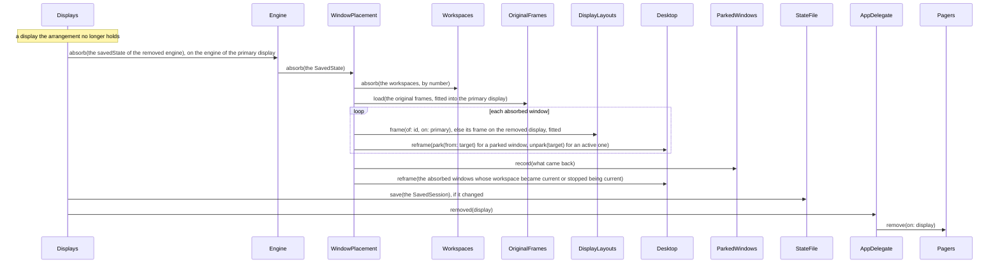
```mermaid
sequenceDiagram
    Note over Displays: a display the arrangement no longer holds
    Displays->>Engine: absorb(the savedState of the removed engine), on the engine of the primary display
    Engine->>WindowPlacement: absorb(the SavedState)
    WindowPlacement->>Workspaces: absorb(the workspaces, by number)
    WindowPlacement->>OriginalFrames: load(the original frames, fitted into the primary display)
    loop each absorbed window
        WindowPlacement->>DisplayLayouts: frame(of: id, on: primary), else its frame on the removed display, fitted
        WindowPlacement->>Desktop: reframe(park(from: target) for a parked window, unpark(target) for an active one)
    end
    WindowPlacement->>ParkedWindows: record(what came back)
    WindowPlacement->>Desktop: reframe(the absorbed windows whose workspace became current or stopped being current)
    Displays->>StateFile: save(the SavedSession), if it changed
    Displays->>AppDelegate: removed(display)
    AppDelegate->>Pagers: remove(on: display)
```

The removed engine is not stopped: stopping puts its parked windows back on screen. An engine that held no window takes the removed engine's current workspace too, and pins its anchor. A window both engines held keeps its place in the absorbing engine.

### A window moved to another display

A drag reaches OttoWM only as `reframed`, which reparks a parked window and does nothing else. With more than one display, `Displays` reconciles at the start of each binding, of each `created`, `focused` and `unminimized` event, and at the unlock.

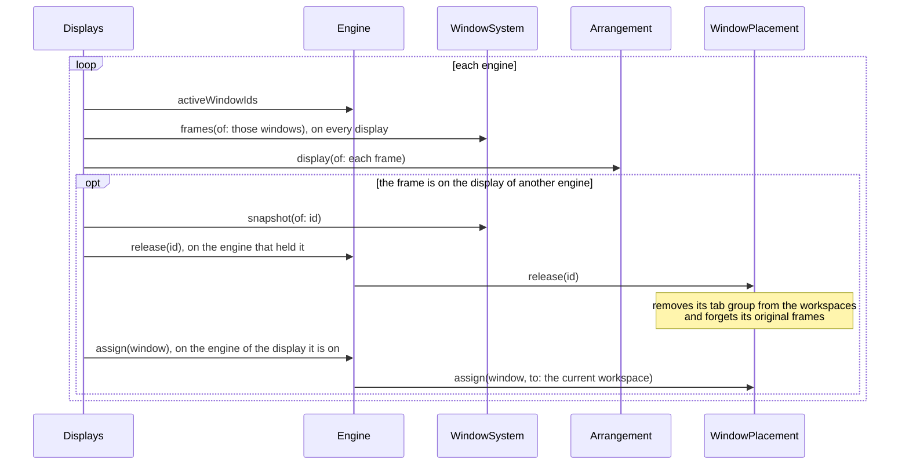
```mermaid
sequenceDiagram
    loop each engine
        Displays->>Engine: activeWindowIds
        Displays->>WindowSystem: frames(of: those windows), on every display
        Displays->>Arrangement: display(of: each frame)
        opt the frame is on the display of another engine
            Displays->>WindowSystem: snapshot(of: id)
            Displays->>Engine: release(id), on the engine that held it
            Engine->>WindowPlacement: release(id)
            Note over WindowPlacement: removes its tab group from the workspaces<br/>and forgets its original frames
            Displays->>Engine: assign(window), on the engine of the display it is on
            Engine->>WindowPlacement: assign(window, to: the current workspace)
        end
    end
```

Parked windows are skipped: a parked window stands at its own display's corner while the arrangement leaves that corner free. A window the on-screen list does not show is left to the engine that holds it. The release keeps the window's layouts. The pass reads the on-screen list once per operation. A `focused` event for a window already assigned reads it for the pass only.

### Full screen round trip

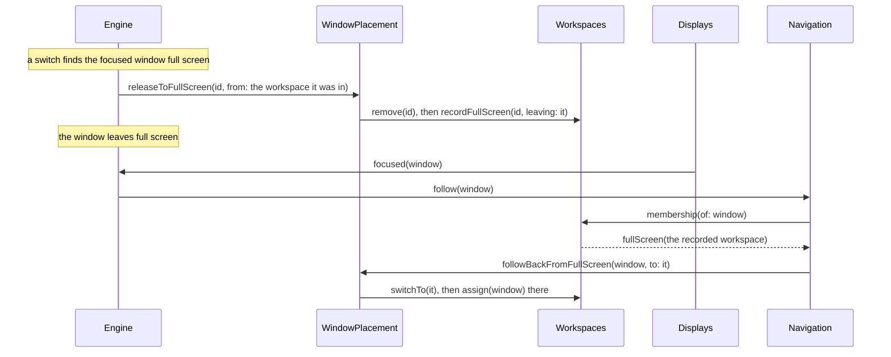
```mermaid
sequenceDiagram
    Note over Engine: a switch finds the focused window full screen
    Engine->>WindowPlacement: releaseToFullScreen(id, from: the workspace it was in)
    WindowPlacement->>Workspaces: remove(id), then recordFullScreen(id, leaving: it)
    Note over Engine: the window leaves full screen
    Displays->>Engine: focused(window)
    Engine->>Navigation: follow(window)
    Navigation->>Workspaces: membership(of: window)
    Workspaces-->>Navigation: fullScreen(the recorded workspace)
    Navigation->>WindowPlacement: followBackFromFullScreen(window, to: it)
    WindowPlacement->>Workspaces: switchTo(it), then assign(window) there
```

The record is taken after the removal, which clears every other trace of the window.

### Config reload

```mermaid
sequenceDiagram
    Hotkeys->>Lifecycle: reload()
    Lifecycle->>Bindings: reload()
    Bindings->>ConfigFile: load()
    ConfigFile-->>Bindings: Config, or a ConfigError
    alt the config parses
        Bindings->>Hotkeys: stop()
        Bindings->>Hotkeys: start() a new tap over the new Config
        Bindings->>Pagers: isEnabled = the pager setting
        Bindings->>Desktop: spacing = the config spacing, on every desktop
    else it does not
        Bindings-->>Lifecycle: the error that kept the bindings already up
        Lifecycle->>ConfigAlert: ask(error)
        alt the user restarts
            ConfigAlert-->>Lifecycle: restart
            Lifecycle->>Lifecycle: relaunch()
        else the user keeps the bindings already up
            ConfigAlert-->>Lifecycle: dismiss
        end
    end
```

The matcher is read on the tap thread, so it is replaced with the tap rather than written under it. The engine, the workspaces and the parked windows are untouched.

### Shutdown

An `LSUIElement` agent has no quit command, so the ways out are a bound `quit` action and a signal. `Lifecycle.relaunch` is the third: it restores the frames the same way, then exits once the new instance is up.

```mermaid
sequenceDiagram
    alt quit action
        Hotkeys->>Lifecycle: quit()
    else SIGTERM
        Note over Lifecycle: the signal source fires
    end
    Lifecycle->>Displays: stop()
    loop each display
        Displays->>Engine: stop()
        Engine->>WindowPlacement: restoreParkedWindows()
        WindowPlacement->>Desktop: reframe(unpark every parked window)
    end
    Displays->>StateFile: save(the SavedSession, no window parked), if it changed
    Lifecycle->>Pagers: dismiss(then: exit)
    Note over Pagers: runs exit once every Pager has slid out
    Lifecycle->>Lifecycle: exit(EXIT_SUCCESS)
```

The default action for SIGTERM ends the process with every parked window still at the hidden edge. `Lifecycle.startWatchingSIGTERM` ignores the signal and takes it on a `DispatchSourceSignal` on the main queue.

### Unlock

Window events are dropped while the screen is locked, and a sweep run behind the login window reads every window as closed, so the registry and the workspaces drift apart. Unlocking closes the gap: `Lifecycle` runs the removals first and the additions after.

```mermaid
sequenceDiagram
    ScreenLock->>Lifecycle: unlocked
    Lifecycle->>RunningApplicationsObserver: resync()
    RunningApplicationsObserver->>AXWindowEvents: sweepDeadWindows()
    AXWindowEvents->>Displays: destroyed(windowId), for each window that stopped answering
    Displays->>Engine: destroyed(windowId), on the engine holding it
    loop each running application
        RunningApplicationsObserver->>AXWindowEvents: inventory(app), or start(app) for one not watched yet
        AXWindowEvents-->>RunningApplicationsObserver: every window the application holds
    end
    RunningApplicationsObserver-->>Lifecycle: the windows of every application
    Lifecycle->>Displays: resync(windows:)
    Note over Displays: follows the screen changes behind the lock,<br/>then reconciles
    Displays->>Engine: resync(the windows it holds or that are on its display), on every engine
    Engine->>WindowPlacement: assign the ones no workspace knows to the current workspace
```

### Window lifecycle

```mermaid
flowchart LR
    new[new or discovered window] -->|valid| managed[in a workspace]
    managed -->|minimized, full screen, destroyed, its application terminated, or moved to another native Space| unmanaged
    unmanaged -->|unminimized, or focused again| managed
    managed -->|"moved to another display: released by one engine, assigned by the other"| managed
```

## Tabbed windows

macOS reports no tab membership, so OttoWM infers it. A tab group is one window to macOS: its tabs minimize, restore and move together.

### Discovery

```mermaid
sequenceDiagram
    participant Application
    participant RunningApplicationsObserver
    participant Displays
    participant Engine
    participant Navigation
    participant WindowPlacement
    participant Workspaces
    participant TabGroups

    Application->>RunningApplicationsObserver: the focused window changed
    Note over RunningApplicationsObserver: Application.attach registers the window before the event goes on
    RunningApplicationsObserver->>Displays: focused(window)
    Displays->>Engine: focused(window)
    Engine->>Navigation: follow(window)
    Navigation->>WindowPlacement: assign(window)
    WindowPlacement->>Workspaces: assign(window)
    Workspaces->>TabGroups: add(window)
    Note over TabGroups: reads how many tabs the window shows
    TabGroups-->>Workspaces: the group it joined
    Workspaces-->>Navigation: the workspace of that group
    Note over Navigation: a different workspace means the user is followed there
```

An application lists only the active tab of a group, and sends no notification when the user switches tabs. A background tab is discovered when it takes the focus, through this event or through `AXWindowEvents.adoptFocusedWindow`, which `WindowSystem.focused()` reads through.

### Membership

```mermaid
flowchart LR
    win[window being assigned] --> tabs{more than one tab?}
    tabs -->|no| own["opens a new group"]
    tabs -->|yes| match{"same application, fewer members than the window has tabs,<br/>same x, y within 10 pt, width and height within 30 pt<br/>of where a group is now?"}
    match -->|yes| join[joins that group]
    match -->|no| own
```

Merging windows into tabs posts no notification, so a window seen before the merge still holds a group of its own. A window alone in its group is matched again every time it is added, one with siblings is not: it joins the group of the window it was merged into, and the group it leaves is dropped. Matching reads the tab count, so it happens when a window is focused for an action or moved, not on a workspace switch.

### Group events

| Event                                              | What OttoWM does                                                                                          |
|----------------------------------------------------|-----------------------------------------------------------------------------------------------------------|
| A tab takes the focus for the first time           | Adds it to a group, and assigns it the workspace of that group. The group does not follow the new window. |
| The group of that tab is in another workspace      | Switches to that workspace.                                                                               |
| A workspace switch, or a move to another workspace | Places every member of the group together.                                                                |
| A tab closes                                       | Drops the window. A sibling keeps the focus, so no other window is chosen.                                |
| Two windows are merged into tabs                   | Matches the window acted on again, and it joins the group of the window it was merged into.               |
| The group is minimized                             | macOS minimizes every member and names one. Drops all of them, then picks a new window to focus.          |
