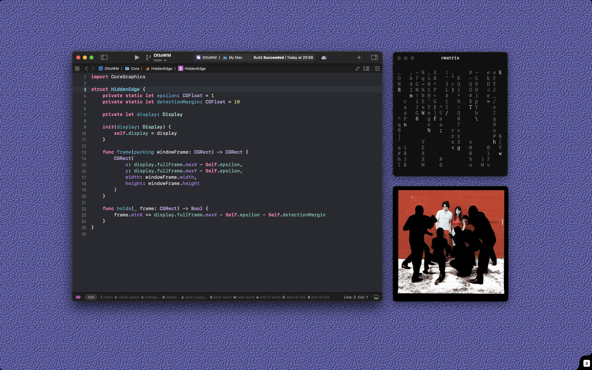
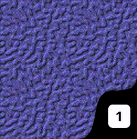
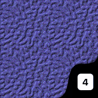
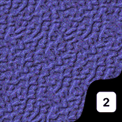

<div align="center">
  <h3>
    <br>
    OttoWM
  </h3>
  <p>
    A tiny virtual workspace manager for macOS<br>
    <i>Inspired by <a href="https://github.com/venam/2bwm">2bwm</a> and <a href="https://github.com/wmutils/core">wmutils</a>,<br>
    and by the technical approach of <a href="https://github.com/nikitabobko/AeroSpace">AeroSpace</a></i>.
  </p>
  <p>
    <a href="https://github.com/brennovich/ottowm/releases/latest"></a>
    <a href="https://github.com/brennovich/ottowm/actions/workflows/deployment-pipeline.yml"></a>
    <a href="https://github.com/brennovich/ottowm/actions/workflows/deployment-pipeline.yml"></a>
  </p>
</div>

<hr>



OttoWM is a window manager for macOS under intense development.

Some important foundations:
- No dependency on third-party libraries or frameworks
- Relies on macOS public APIs only (up until now)
- Backwards compatibility, it works on macOS Big Sur onwards

## Features

It brings the workflow of a common Linux window manager to macOS, without fighting with Mission Control:

- Native macOS Spaces keep working, whatever happens there won't affect OttoWM
- Full screen apps are restored to their respective state when leaving full screen
- Reaching a window through Cmd-Tab, the Dock or Mission Control switches to its workspace

### Workspaces

Multiple workspaces on a **single native macOS Space**: no Space switch animation, no Mission Control. A window that leaves a workspace is parked in the bottom right corner, a point of it left on screen, and comes back to the frame it had, with the focus it had.

### Pager

OttoWM relies on the same strategy as [AeroSpace](https://nikitabobko.github.io/AeroSpace/guide#emulation-of-virtual-workspaces), a tiny portion of windows accumulates in the bottom right corner, so the Pager covers this spot while offering nice other features.

<table>
  <tr>
    <th width="33%" align="center">Current workspace badge</th>
    <th width="33%" align="center">Smart auto-hide</th>
    <th width="33%" align="center">Secure input cue</th>
  </tr>
  <tr>
    <td align="center"></td>
    <td align="center"></td>
    <td align="center"></td>
  </tr>
  <tr>
    <td valign="top">The tab tells which workspace is current.</td>
    <td valign="top">It squeezes against the screen edge while a window reaches into the corner, and comes back once the corner is free.</td>
    <td valign="top">A pulse cue irradiates while an app holds secure input, e.g. a password field is focused, Password.app auth: every keystroke is withheld from OttoWM, so no binding works.</td>
  </tr>
</table>

Option-click the tab to open the About window.

### Tabbed windows

Native tab groups (Terminal, Ghostty, Finder, …) count as one window: sending a tab to another workspace takes the whole group, and the group comes back with the tab that was active.

## Install

Download the latest `OttoWM-<version>.zip` from [Releases](https://github.com/brennovich/ottowm/releases):

```sh
curl -fsSL "$(curl -fsSL https://api.github.com/repos/brennovich/ottowm/releases/latest | grep -o 'https://[^"]*\.zip')" -o OttoWM.zip
unzip OttoWM.zip -d /Applications
xattr -cr /Applications/OttoWM.app
open /Applications/OttoWM.app
```

The app is ad-hoc signed, so Gatekeeper refuses it as coming from an unidentified developer until you clear the quarantine attribute. OttoWM needs Accessibility permission; grant it in System Settings → Privacy & Security → Accessibility on first launch.

## Requirements

OttoWM expects a few macOS settings to be in place. They all live in System Settings → Desktop & Dock, under Mission Control and Dock.

| Setting                                                 | Value | Why                                                                          |
| ------------------------------------------------------- | ----- | ---------------------------------------------------------------------------- |
| Group windows by application                            | on    | Fixes the positioning of windows on Mission Control                          |
| Displays have separate Spaces                           | on    | Each display keeps its own Space, so a workspace switch stays on one display |
| Automatically rearrange Spaces based on most recent use | off   | The Space order stays fixed, so the Space OttoWM runs on does not move       |
| Automatically hide and show the Dock                    | on    | Keep the parked windows as hidden as possible                                |

```sh
defaults write com.apple.dock expose-group-apps -bool true
defaults write com.apple.spaces spans-displays -bool false
defaults write com.apple.dock mru-spaces -bool false
defaults write com.apple.dock autohide -bool true
killall Dock
```

`spans-displays` only takes effect after a log out.

To restore the macOS defaults:

```sh
defaults delete com.apple.dock expose-group-apps
defaults delete com.apple.spaces spans-displays
defaults delete com.apple.dock mru-spaces
defaults delete com.apple.dock autohide
killall Dock
```

## Configuration

You can define your own bindings by creating a `~/.config/ottowm/ottowm`, it's a good idea to start from the default:

```sh
mkdir -p ~/.config/ottowm
cp /Applications/OttoWM.app/Contents/Resources/ottowm ~/.config/ottowm/
```

```
# This is a comment

# One `key combo = action`
lopt-1 = switch-to-workspace 1

# or `setting = value` per line
spacing = 20

lopt-shift-1 = move-window-to-workspace 1
lopt-h = focus west
lopt-shift-h = move-window west

# CMD+Ctrl+Option+Shift+Q quits OttoWM
hyper-5 = switch-to-workspace 5
```

<table>
  <tr>
    <th width="27%" align="left">Entry</th>
    <th width="10%" align="left">Type</th>
    <th width="20%" align="left">Default</th>
    <th width="43%" align="left">Description</th>
  </tr>
  <tr>
    <td>switch-to-workspace&nbsp;<code>N</code></td>
    <td>Action</td>
    <td>&nbsp;⌥ + 1–4</td>
    <td>Switch to workspace N</td>
  </tr>
  <tr>
    <td>move-window-to-workspace&nbsp;<code>N</code></td>
    <td>Action</td>
    <td>&nbsp;⌥⇧ + 1–4</td>
    <td>Move the focused window to workspace N</td>
  </tr>
  <tr>
    <td>focus&nbsp;<code>D</code></td>
    <td>Action</td>
    <td>&nbsp;⌥ + H/J/K/L</td>
    <td>Focus the window <code>D</code> leads to: <code>north</code>, <code>east</code>, <code>south</code> or <code>west</code></td>
  </tr>
  <tr>
    <td>move-window&nbsp;<code>D</code></td>
    <td>Action</td>
    <td>&nbsp;⌥⇧ + H/J/K/L</td>
    <td>Move the focused window <code>D</code> by the spacing</td>
  </tr>
  <tr>
    <td>resize&nbsp;<code>C</code></td>
    <td>Action</td>
    <td>&nbsp;⌥⌃⇧ + H/J/K/L</td>
    <td>Resize the focused window by the spacing: <code>C</code> is <code>wider</code>, <code>narrower</code>, <code>taller</code> or <code>shorter</code></td>
  </tr>
  <tr>
    <td>center-window</td>
    <td>Action</td>
    <td>&nbsp;⌥⌃ + C</td>
    <td>Center the focused window on the screen, keeping its size</td>
  </tr>
  <tr>
    <td>maximize</td>
    <td>Action</td>
    <td>&nbsp;⌥⌃ + M</td>
    <td>Fill the screen with the focused window (toggable)</td>
  </tr>
  <tr>
    <td>tile&nbsp;<code>D</code></td>
    <td>Action</td>
    <td>&nbsp;⌥⌃ + H/J/K/L</td>
    <td>Tile the focused window to the half of the screen <code>D</code> leads to (toggable)</td>
  </tr>
  <tr>
    <td>quit</td>
    <td>Action</td>
    <td>⌘⌃⌥⇧ + Q</td>
    <td>Quit OttoWM, putting every parked window back</td>
  </tr>
  <tr>
    <td>restart</td>
    <td>Action</td>
    <td>⌘⌃⌥⇧ + R</td>
    <td>Read the config file again and rebind the keys</td>
  </tr>
  <tr>
    <td>about</td>
    <td>Action</td>
    <td>⌘⌃⌥⇧ + A</td>
    <td>Open the About window: version, Accessibility and hotkeys status, the config in use and the macOS settings above (toggable)</td>
  </tr>
  <tr>
    <td>pager&nbsp;=&nbsp;<code>off</code></td>
    <td>Setting</td>
    <td><code>on</code></td>
    <td>Hide the tab in the bottom right corner that shows the current workspace and covers the parked windows</td>
  </tr>
  <tr>
    <td>spacing&nbsp;=&nbsp;<code>N</code></td>
    <td>Setting</td>
    <td><code>15</code></td>
    <td>Number of points for the <em>gap</em>, the <code>move-window</code> <em>step</em> and the <code>resize</code> change</td>
  </tr>
</table>

**Note**: _⌘ Command, ⌃ Control, ⌥ Option, ⇧ Shift. By default only the **left** Option (`lopt`) key triggers the default workspace bindings; the right one is left free for typing special characters™. You can always rebind to use both with `opt` instead._

## Debugging

The About window (`hyper-a`, or Option-click on the pager tab) displays the all requirements and status statuses of the system, alongside with config and debug tools.

```sh
log stream --level debug --predicate 'subsystem == "com.github.brennovich.ottowm"'
```

## Limitations

- No support for two displays at once (yet). But position and windows size are preserved per display
- Switching to a workspace from an unmanaged native Space or a full screen app only works when that workspace has a window to activate. When it has none, another workspace that does is activated instead, because macOS has no public API to switch Spaces

<hr>

**Note**: I have been a software developer for a long time, but this project was built with the help of AI tools, as an opportunity to learn Swift and macOS development.
